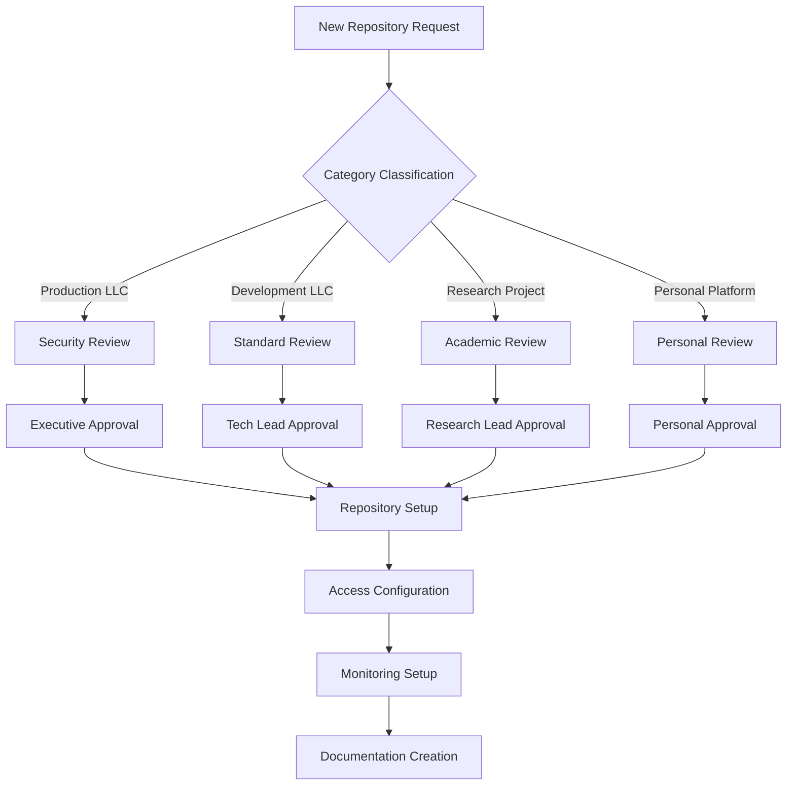
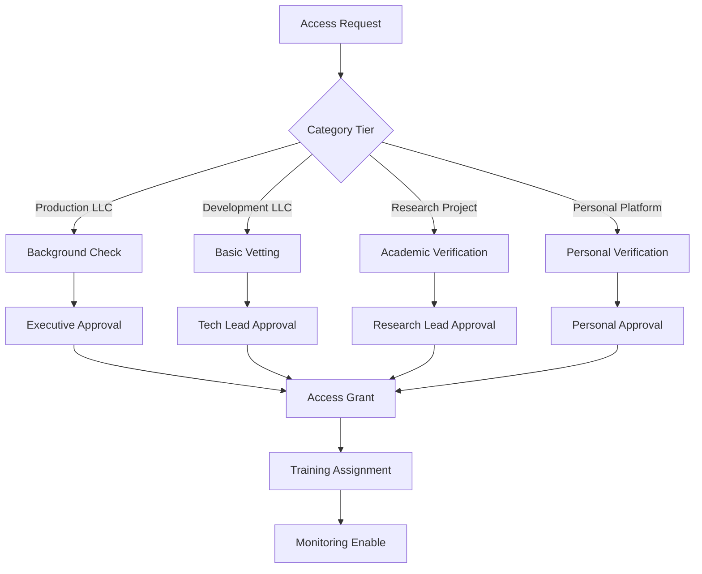

# **🏢 CORRECTED LLC GOVERNANCE FRAMEWORK**

## **📋 GOVERNANCE FOR CORRECTED STRUCTURE**

This governance framework is designed for the corrected repository structure with 3 actual LLCs, research under meatheadphysicist, and personal platforms in `.personal`.

---

## **🎯 REPOSITORY CLASSIFICATION**

### **🔴 Production LLCs (Tier 1)**
**Critical Business Operations - Maximum Security**

| LLC | Repository | Business Function | Security Level | Approvals Required |
|-----|------------|-------------------|----------------|-------------------|
| **repz-llc** | repz | AI Coaching Platform | Maximum | 2 |
| **live-it-iconic-llc** | liveiticonic | Fashion E-commerce | Maximum | 2 |

**Requirements**:
- ✅ SSO authentication required
- ✅ 2FA enforcement for all contributors
- ✅ Real-time security monitoring
- ✅ Automated vulnerability scanning
- ✅ Weekly security reviews
- ✅ Incident response team on-call

### **🟡 Development LLCs (Tier 2)**
**Commercial Development - Standard Security**

| LLC | Repository | Business Function | Security Level | Approvals Required |
|-----|------------|-------------------|----------------|-------------------|
| **alawein-technologies-llc** | simcore | Computational Physics | Standard | 1 |
| **alawein-technologies-llc** | qmlab | Quantum Mechanics | Standard | 1 |
| **alawein-technologies-llc** | attributa | Data Analytics | Standard | 1 |
| **alawein-technologies-llc** | llmworks | LLM Development | Standard | 1 |

**Requirements**:
- ✅ SSO authentication required
- ✅ 2FA enforcement for contributors
- ✅ Standard security monitoring
- ✅ Automated dependency scanning
- ✅ Monthly security reviews

### **🔵 Research Projects (Tier 3)**
**Academic Research - Flexible Security**

| Repository | Location | Research Function | Security Level | Approvals Required |
|------------|----------|-------------------|----------------|-------------------|
| spincirc | meatheadphysicist/ | Spin Transport Circuits | Basic | 1 |
| materials-science | meatheadphysicist/ | Materials Research | Basic | 1 |

**Requirements**:
- ✅ Standard authentication
- ✅ Basic security monitoring
- ✅ Publication-ready versioning
- ✅ Academic compliance checks

### **👤 Personal Platforms (Tier 3)**
**Personal Development - Flexible Security**

| Repository | Location | Personal Function | Security Level | Approvals Required |
|------------|----------|-------------------|----------------|-------------------|
| drmalowein | .personal/ | Academic Portfolio | Basic | 1 |
| rounaq | .personal/ | Fashion E-commerce | Basic | 1 |
| meshal-alawein | .personal/ | Personal Portfolio | Basic | 1 |

**Requirements**:
- ✅ Standard authentication
- ✅ Basic security monitoring
- ✅ Personal development versioning
- ✅ Personal data protection

### **⚫ Archived Systems (Tier 4)**
**Inactive Projects - Restricted Access**

| Repository | Archive Location | Original Location | Archive Date | Retention |
|------------|------------------|-------------------|--------------|-----------|
| automation-ts | .archive/projects/ | Root level | 2025-12-06 | 7 years |
| benchmarks-consolidation | .archive/projects/ | Root level | 2025-12-06 | 7 years |

**Requirements**:
- ✅ Read-only access only
- ✅ Governance approval for restoration
- ✅ Compliance audit access
- ✅ 7-year retention policy

---

## **🔧 ACCESS CONTROL MATRIX**

### **Team-Based Access Control**

| Team | Production LLCs | Development LLCs | Research Projects | Personal Platforms | Archive |
|------|-----------------|------------------|-------------------|-------------------|---------|
| **Executive** | Admin | Admin | Admin | Admin | Admin |
| **Tech Leads** | Write/Maintain | Write/Maintain | Write | Write/Maintain | Read |
| **Core Developers** | Write/Triage | Write/Triage | Write | Write | None |
| **Security Team** | Write/Security | Write/Security | Read | Read | Read |
| **Compliance Team** | Read/Policy | Read/Policy | Read/Policy | Read/Policy | Read/Audit |
| **External Contributors** | Read | Read/Triage | Read | Read | None |

### **Category-Specific Permissions**

#### **Production LLCs (repz-llc, live-it-iconic-llc)**
- **Owner**: Meshal Alawein
- **Tech Leads**: 2 designated leads per LLC
- **Core Team**: 3-5 developers per LLC
- **Security**: Dedicated security team member
- **Access**: SSO + 2FA required

#### **Development LLC (alawein-technologies-llc)**
- **Owner**: Meshal Alawein
- **Tech Leads**: Project-specific leads
- **Developers**: Contract and full-time developers
- **Consultants**: External technical consultants
- **Access**: SSO + 2FA required

#### **Research Projects (meatheadphysicist/)**
- **Owner**: Meshal Alawein (meatheadphysicist persona)
- **Research Lead**: Principal investigator
- **Researchers**: Academic contributors
- **Students**: Graduate and undergraduate researchers
- **Access**: Standard authentication

#### **Personal Platforms (.personal/)**
- **Owner**: Meshal Alawein (personal)
- **Family Members**: Direct family contributors
- **Collaborators**: Personal project collaborators
- **Guest Contributors**: Temporary access for specific projects
- **Access**: Standard authentication

---

## **🛡️ SECURITY POLICIES BY CATEGORY**

### **Production LLCs Security**
```yaml
Security:
  Authentication: SSO + 2FA Required
  Monitoring: 24/7 Real-time
  Scanning: Daily vulnerability scans
  Compliance: SOX, GDPR, PCI-DSS
  Backup: Real-time replication
  Incident Response: <1 hour response time
  
Access Control:
  Branch Protection: Strict (2 approvals)
  Code Review: Mandatory for all changes
  Deployments: Automated with approval gates
  Secrets: Encrypted with rotation
  Audit: Immutable audit logs
```

### **Development LLCs Security**
```yaml
Security:
  Authentication: SSO + 2FA Required
  Monitoring: Business hours
  Scanning: Weekly vulnerability scans
  Compliance: Basic GDPR
  Backup: Daily backups
  Incident Response: <4 hour response time
  
Access Control:
  Branch Protection: Standard (1 approval)
  Code Review: Required for production changes
  Deployments: Automated with basic checks
  Secrets: Encrypted storage
  Audit: Standard logging
```

### **Research Projects Security**
```yaml
Security:
  Authentication: Standard
  Monitoring: Basic logging
  Scanning: Monthly scans
  Compliance: Academic standards
  Backup: Weekly backups
  Incident Response: <24 hour response time
  
Access Control:
  Branch Protection: Basic
  Code Review: Peer review encouraged
  Deployments: Manual process
  Secrets: Basic encryption
  Audit: Research compliance logs
```

### **Personal Platforms Security**
```yaml
Security:
  Authentication: Standard
  Monitoring: Basic logging
  Scanning: Monthly scans
  Compliance: Personal data standards
  Backup: Weekly backups
  Incident Response: <24 hour response time
  
Access Control:
  Branch Protection: Basic
  Code Review: Optional
  Deployments: Manual/Automated hybrid
  Secrets: Basic encryption
  Audit: Personal activity logs
```

---

## **📊 COMPLIANCE FRAMEWORK**

### **Regulatory Compliance by Category**

| Regulation | Production LLCs | Development LLCs | Research Projects | Personal Platforms |
|------------|-----------------|------------------|-------------------|-------------------|
| **GDPR** | ✅ Full Compliance | ✅ Data Protection | ✅ Research Data | ✅ Personal Data |
| **SOX** | ✅ Financial Controls | ⚠️ Limited Scope | ❌ Not Applicable | ❌ Not Applicable |
| **PCI-DSS** | ✅ Payment Processing | ⚠️ Development Only | ❌ Not Applicable | ❌ Not Applicable |
| **Export Controls** | ✅ Technology Export | ✅ Development Export | ⚠️ Research Export | ❌ Not Applicable |
| **Academic Compliance** | ⚠️ Limited | ⚠️ Limited | ✅ Full Compliance | ❌ Not Applicable |
| **Personal Data** | ⚠️ Business Data | ⚠️ Business Data | ❌ Research Data | ✅ Personal Data |

### **Automated Compliance Checks**
```yaml
Daily Checks:
  - Dependency vulnerability scanning
  - License compliance verification
  - Data protection validation
  - Access control auditing

Weekly Checks:
  - Security posture assessment
  - Compliance reporting
  - Risk evaluation
  - Performance monitoring

Monthly Checks:
  - Full compliance audit
  - Legal review completion
  - Policy compliance verification
  - Training compliance check
```

---

## **🔄 GOVERNANCE WORKFLOWS**

### **Repository Creation Workflow**


### **Access Request Workflow**


---

## **📈 MONITORING & REPORTING**

### **Category Health Dashboard**
```yaml
Production LLCs:
  repz-llc/repz:
    Status: 🟢 Operational
    Security: 95% Score
    Performance: 99.9% Uptime
    Compliance: 100% Compliant
    
  live-it-iconic-llc/liveiticonic:
    Status: 🟢 Operational
    Security: 92% Score
    Performance: 99.8% Uptime
    Compliance: 100% Compliant
    
Development LLCs:
  alawein-technologies-llc/*:
    Status: 🟡 Active Development
    Security: 88% Score
    Performance: 98% Uptime
    Compliance: 95% Compliant
    
Research Projects:
  meatheadphysicist/*:
    Status: 🔵 Research Active
    Security: 85% Score
    Performance: 95% Uptime
    Compliance: 90% Compliant
    
Personal Platforms:
  .personal/*:
    Status: 👤 Personal Development
    Security: 80% Score
    Performance: 90% Uptime
    Compliance: 85% Compliant
```

### **Automated Reporting**
```bash
# Daily category status report
npm run governance:daily-report

# Weekly compliance summary
npm run governance:weekly-compliance

# Monthly governance review
npm run governance:monthly-review

# Quarterly strategic assessment
npm run governance:quarterly-assessment
```

---

## **🚀 IMPLEMENTATION COMMANDS**

### **Category Repository Management**
```bash
# Create new LLC repository
npm run llc:create -- --llc=alawein-technologies-llc --repo=newproject --tier=development

# Create research project
npm run research:create -- --project=newresearch --location=meatheadphysicist

# Create personal platform
npm run personal:create -- --platform=newpersonal --location=.personal

# Configure category governance
npm run category:configure -- --category=production-llc --repo=repz --tier=production
```

### **Security & Compliance**
```bash
# Run category-specific security scan
npm run security:scan -- --category=production-llc

# Validate category compliance
npm run compliance:check -- --category=development-llc

# Update security policies by category
npm run security:update -- --category=research --policy=latest

# Generate category audit report
npm run audit:report -- --category=all --period=monthly
```

---

## **🎯 SUCCESS METRICS**

### **Category Governance KPIs**
- **Production LLCs Security Score**: 95%+
- **Development LLCs Security Score**: 88%+
- **Research Projects Security Score**: 85%+
- **Personal Platforms Security Score**: 80%+
- **Compliance Rate**: 100% for critical regulations
- **Response Time**: <1 hour for production incidents

### **Operational Excellence**
- **Automation Coverage**: 80%+ of governance tasks
- **Deployment Frequency**: Daily for development LLCs
- **Issue Resolution**: <24 hours for all categories
- **Training Compliance**: 100% for all contributors
- **Performance**: 99.9% uptime for production LLCs

---

## **📋 CATEGORY-SPECIFIC GUIDELINES**

### **Production LLCs Guidelines**
- Maximum security and compliance requirements
- Strict change management and approval processes
- Real-time monitoring and incident response
- Regular security audits and penetration testing
- Business continuity and disaster recovery planning

### **Development LLCs Guidelines**
- Standard security practices with flexibility
- Efficient development workflows with quality gates
- Regular dependency updates and vulnerability management
- Code quality standards and automated testing
- Documentation and knowledge sharing requirements

### **Research Projects Guidelines**
- Academic freedom with basic security standards
- Publication-ready versioning and documentation
- Collaboration tools for academic partnerships
- Data management and research compliance
- Open science and knowledge dissemination

### **Personal Platforms Guidelines**
- Personal development with basic security
- Flexible workflows for creative projects
- Personal data protection and privacy
- Family collaboration and sharing capabilities
- Portfolio and personal branding support

---

**Last Updated**: December 6, 2025  
**Governance Model**: Corrected LLC + Research + Personal Structure  
**Implementation**: Phase 1 Complete  
**Next Phase**: Documentation Architecture (Phase 2)
