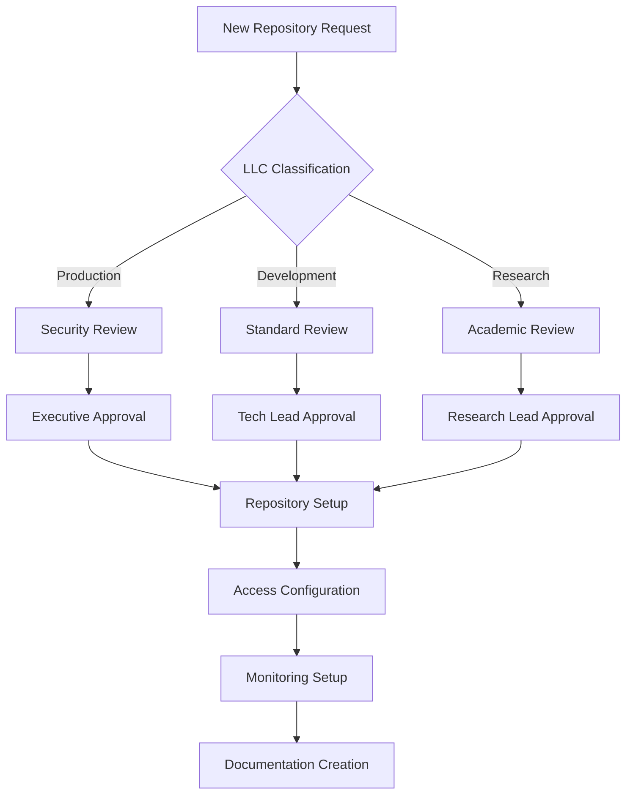
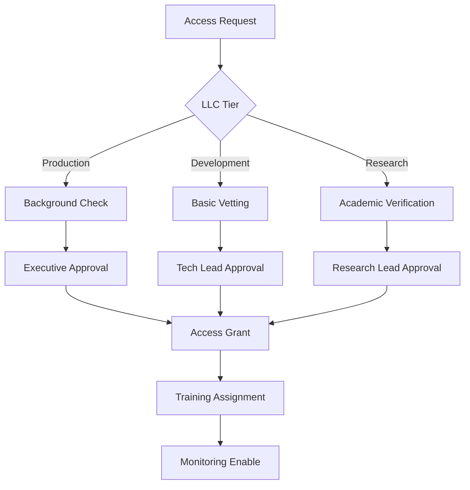
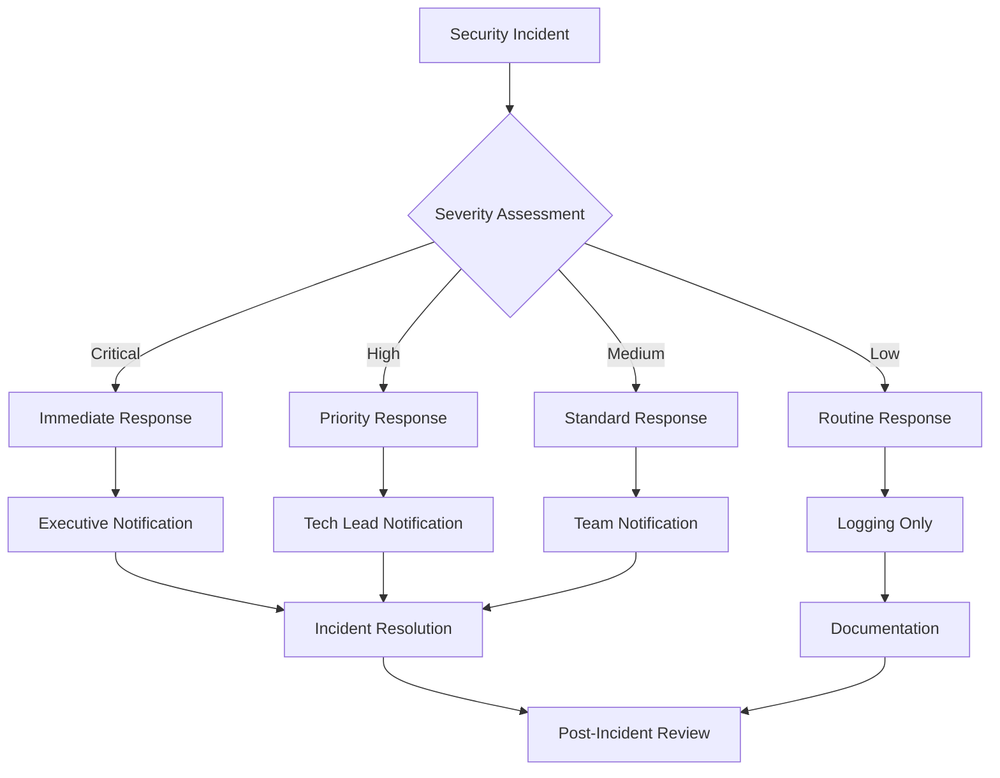

# **🏢 FLAT LLC GOVERNANCE FRAMEWORK**

## **📋 GOVERNANCE FOR FLAT LLC STRUCTURE**

This governance framework is designed for a practical flat LLC repository structure without GitHub organization overhead.

---

## **🎯 LLC REPOSITORY CLASSIFICATION**

### **🔴 Production LLCs (Tier 1)**
**Critical Business Operations - Maximum Security**

| LLC | Repository | Business Function | Security Level | Approvals Required |
|-----|------------|-------------------|----------------|-------------------|
| **repz-llc** | repz | AI Coaching Platform | Maximum | 2 |
| **live-it-iconic-llc** | liveiticonic | Fashion E-commerce | Maximum | 2 |
| **family-platforms-llc** | drmalowein | Academic Portfolio | High | 2 |
| **family-platforms-llc** | rounaq | Fashion E-commerce | High | 2 |

**Requirements**:
- ✅ SSO authentication required
- ✅ 2FA enforcement for all contributors
- ✅ Real-time security monitoring
- ✅ Automated vulnerability scanning
- ✅ Weekly security reviews
- ✅ Incident response team on-call

### **🟡 Development LLCs (Tier 2)**
**Commercial Development - Standard Security**

| LLC | Repository | Business Function | Security Level | Approvals Required |
|-----|------------|-------------------|----------------|-------------------|
| **alawein-technologies-llc** | simcore | Computational Physics | Standard | 1 |
| **alawein-technologies-llc** | qmlab | Quantum Mechanics | Standard | 1 |
| **alawein-technologies-llc** | attributa | Data Analytics | Standard | 1 |
| **alawein-technologies-llc** | llmworks | LLM Development | Standard | 1 |

**Requirements**:
- ✅ SSO authentication required
- ✅ 2FA enforcement for contributors
- ✅ Standard security monitoring
- ✅ Automated dependency scanning
- ✅ Monthly security reviews

### **🔵 Research LLCs (Tier 3)**
**Academic Research - Flexible Security**

| LLC | Repository | Research Function | Security Level | Approvals Required |
|-----|------------|-------------------|----------------|-------------------|
| **research-llc** | spincirc | Spin Transport Circuits | Basic | 1 |
| **research-llc** | materials-science | Materials Research | Basic | 1 |

**Requirements**:
- ✅ Standard authentication
- ✅ Basic security monitoring
- ✅ Publication-ready versioning
- ✅ Academic compliance checks

### **⚫ Archived Systems (Tier 4)**
**Inactive Projects - Restricted Access**

| Repository | Archive Location | Original LLC | Archive Date | Retention |
|------------|------------------|--------------|--------------|-----------|
| automation-ts | .archive/projects/ | alawein-technologies-llc | 2025-12-06 | 7 years |
| benchmarks-consolidation | .archive/projects/ | alawein-technologies-llc | 2025-12-06 | 7 years |

**Requirements**:
- ✅ Read-only access only
- ✅ Governance approval for restoration
- ✅ Compliance audit access
- ✅ 7-year retention policy

---

## **🔧 ACCESS CONTROL MATRIX**

### **Team-Based Access Control**

| Team | Production LLCs | Development LLCs | Research LLCs | Archive |
|------|-----------------|------------------|---------------|---------|
| **Executive** | Admin | Admin | Admin | Admin |
| **Tech Leads** | Write/Maintain | Write/Maintain | Write | Read |
| **Core Developers** | Write/Triage | Write/Triage | Write | None |
| **Security Team** | Write/Security | Write/Security | Read | Read |
| **Compliance Team** | Read/Policy | Read/Policy | Read/Policy | Read/Audit |
| **External Contributors** | Read | Read/Triage | Read | None |

### **LLC-Specific Permissions**

#### **repz-llc (AI Coaching Platform)**
- **Owner**: Meshal Alawein
- **Tech Leads**: 2 designated leads
- **Core Team**: 5 developers
- **Security**: Dedicated security team member
- **Access**: SSO + 2FA required

#### **live-it-iconic-llc (Fashion E-commerce)**
- **Owner**: Meshal Alawein
- **Business Lead**: Business operations manager
- **Tech Lead**: Technical development lead
- **Design Team**: Creative contributors
- **Access**: SSO + 2FA required

#### **family-platforms-llc (Family Digital Presence)**
- **Owner**: Meshal Alawein
- **Family Members**: Direct family contributors
- **Tech Lead**: Technical oversight
- **Content Team**: Content management
- **Access**: SSO + 2FA required

#### **alawein-technologies-llc (Commercial Tech)**
- **Owner**: Meshal Alawein
- **Tech Leads**: Project-specific leads
- **Developers**: Contract and full-time developers
- **Consultants**: External technical consultants
- **Access**: SSO + 2FA required

#### **research-llc (Academic Research)**
- **Owner**: Meshal Alawein
- **Research Lead**: Principal investigator
- **Researchers**: Academic contributors
- **Students**: Graduate and undergraduate researchers
- **Access**: Standard authentication

---

## **🛡️ SECURITY POLICIES BY LLC TIER**

### **Production LLCs Security**
```yaml
Security:
  Authentication: SSO + 2FA Required
  Monitoring: 24/7 Real-time
  Scanning: Daily vulnerability scans
  Compliance: SOX, GDPR, PCI-DSS
  Backup: Real-time replication
  Incident Response: <1 hour response time
  
Access Control:
  Branch Protection: Strict (2 approvals)
  Code Review: Mandatory for all changes
  Deployments: Automated with approval gates
  Secrets: Encrypted with rotation
  Audit: Immutable audit logs
```

### **Development LLCs Security**
```yaml
Security:
  Authentication: SSO + 2FA Required
  Monitoring: Business hours
  Scanning: Weekly vulnerability scans
  Compliance: Basic GDPR
  Backup: Daily backups
  Incident Response: <4 hour response time
  
Access Control:
  Branch Protection: Standard (1 approval)
  Code Review: Required for production changes
  Deployments: Automated with basic checks
  Secrets: Encrypted storage
  Audit: Standard logging
```

### **Research LLCs Security**
```yaml
Security:
  Authentication: Standard
  Monitoring: Basic logging
  Scanning: Monthly scans
  Compliance: Academic standards
  Backup: Weekly backups
  Incident Response: <24 hour response time
  
Access Control:
  Branch Protection: Basic
  Code Review: Peer review encouraged
  Deployments: Manual process
  Secrets: Basic encryption
  Audit: Research compliance logs
```

---

## **📊 COMPLIANCE FRAMEWORK**

### **Regulatory Compliance by LLC**

| Regulation | Production LLCs | Development LLCs | Research LLCs |
|------------|-----------------|------------------|---------------|
| **GDPR** | ✅ Full Compliance | ✅ Data Protection | ✅ Research Data |
| **SOX** | ✅ Financial Controls | ⚠️ Limited Scope | ❌ Not Applicable |
| **PCI-DSS** | ✅ Payment Processing | ⚠️ Development Only | ❌ Not Applicable |
| **Export Controls** | ✅ Technology Export | ✅ Development Export | ⚠️ Research Export |
| **Academic Compliance** | ⚠️ Limited | ⚠️ Limited | ✅ Full Compliance |

### **Automated Compliance Checks**
```yaml
Daily Checks:
  - Dependency vulnerability scanning
  - License compliance verification
  - Data protection validation
  - Access control auditing

Weekly Checks:
  - Security posture assessment
  - Compliance reporting
  - Risk evaluation
  - Performance monitoring

Monthly Checks:
  - Full compliance audit
  - Legal review completion
  - Policy compliance verification
  - Training compliance check
```

---

## **🔄 GOVERNANCE WORKFLOWS**

### **Repository Creation Workflow**


### **Access Request Workflow**


### **Incident Response Workflow**


---

## **📈 MONITORING & REPORTING**

### **LLC Health Dashboard**
```yaml
Production LLCs:
  repz-llc/repz:
    Status: 🟢 Operational
    Security: 95% Score
    Performance: 99.9% Uptime
    Compliance: 100% Compliant
    
  live-it-iconic-llc/liveiticonic:
    Status: 🟢 Operational
    Security: 92% Score
    Performance: 99.8% Uptime
    Compliance: 100% Compliant
    
Development LLCs:
  alawein-technologies-llc/*:
    Status: 🟡 Active Development
    Security: 88% Score
    Performance: 98% Uptime
    Compliance: 95% Compliant
    
Research LLCs:
  research-llc/*:
    Status: 🔵 Research Active
    Security: 85% Score
    Performance: 95% Uptime
    Compliance: 90% Compliant
```

### **Automated Reporting**
```bash
# Daily LLC status report
npm run governance:daily-report

# Weekly compliance summary
npm run governance:weekly-compliance

# Monthly governance review
npm run governance:monthly-review

# Quarterly strategic assessment
npm run governance:quarterly-assessment
```

---

## **🚀 IMPLEMENTATION COMMANDS**

### **LLC Repository Management**
```bash
# Create new LLC repository
npm run llc:create -- --llc=alawein-technologies-llc --repo=newproject --tier=development

# Configure LLC governance
npm run llc:configure -- --llc=repz-llc --repo=repz --tier=production

# Update LLC access permissions
npm run llc:update-access -- --llc=family-platforms-llc --team=family-members --permission=write

# Generate LLC compliance report
npm run llc:compliance-report -- --llc=all --format=detailed
```

### **Security & Compliance**
```bash
# Run LLC security scan
npm run llc:security-scan -- --tier=production

# Validate LLC compliance
npm run llc:compliance-check -- --llc=repz-llc

# Update LLC security policies
npm run llc:update-security -- --policy=latest

# Generate LLC audit report
npm run llc:audit-report -- --period=monthly
```

---

## **🎯 SUCCESS METRICS**

### **LLC Governance KPIs**
- **Security Score**: 95%+ for production LLCs
- **Compliance Rate**: 100% for critical regulations
- **Response Time**: <1 hour for production incidents
- **Audit Success**: 100% clean audits
- **Documentation Coverage**: 100% for all LLC repositories

### **Operational Excellence**
- **Automation Coverage**: 80%+ of governance tasks
- **Deployment Frequency**: Daily for development LLCs
- **Issue Resolution**: <24 hours for all LLCs
- **Training Compliance**: 100% for all contributors
- **Performance**: 99.9% uptime for production LLCs

---

**Last Updated**: December 6, 2025  
**Governance Model**: Flat LLC Structure  
**Implementation**: Phase 1 Complete  
**Next Phase**: Documentation Architecture (Phase 2)
