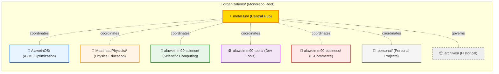
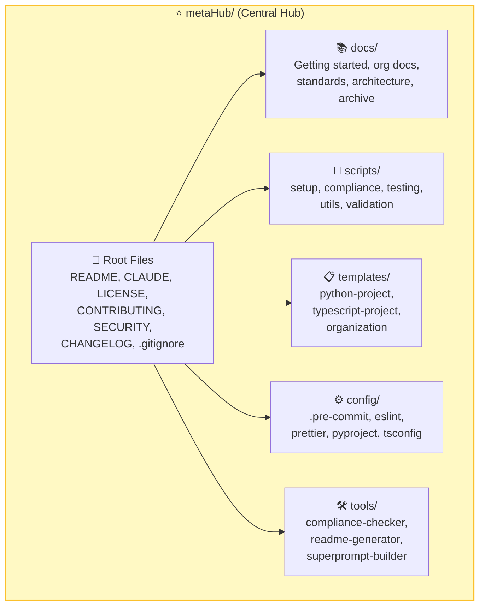
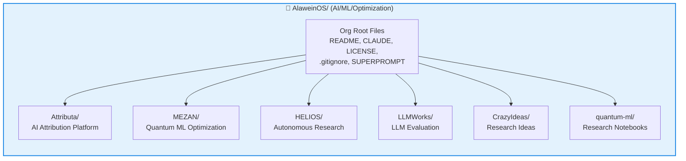

# GitHub Repository Structure & Organization

This document explains the monorepo structure, how **metaHub** serves as the central coordination hub, and how AI assistants should help **evolve and enforce** this structure over time.

> **Note**  
> - All organization and project names are examples; adapt them to your needs.  
> - This document is the **source of truth** for repository organization.  
> - AI assistants must follow the **Root Governance Prompt** at the end of this file before making structural changes.

---

## Table of Contents

- [Repository Overview](#repository-overview)
- [High-Level ASCII Tree](#high-level-ascii-tree)
- [Mermaid Diagrams](#mermaid-diagrams)
  - [Top-Level Monorepo View](#top-level-monorepo-view)
  - [metaHub View](#metahub-view)
  - [Example Organization View](#example-organization-view)
- [Component Breakdown](#component-breakdown)
  - [AlaweinOS](#1-alaweinos-)
  - [MeatheadPhysicist](#2-meatheadphysicist-)
  - [alaweimm90-science](#3-alaweimm90-science-)
  - [alaweimm90-tools](#4-alaweimm90-tools-)
  - [alaweimm90-business](#5-alaweimm90-business-)
  - [.personal](#6-personal-)
  - [archives](#7-archives-)
- [metaHub Organization](#metahub-organization)
- [Common Standards](#common-standards)
- [AI Governance & Refactoring Prompt (ROOT)](#ai-governance--refactoring-prompt-root)

---

## Repository Overview

This repository is a **monorepo** that hosts an entire ecosystem of organizations and projects.

- **Multiple Organizations** grouped by domain
- **Many Projects** across all organizations
- **1 Central Hub (`metaHub/`)** for:
  - documentation
  - shared tooling
  - templates
  - configuration
  - structural governance
- **Optional Personal Organization** for individual projects
- **Archive** for deprecated or historical work

**Repository Root**: `/path/to/your/organizations/`  
**Main Branch**: As configured by GitHub  
**Primary Goal**: Provide a **coherent, maintainable structure** that can scale, be refactored, and be enforced by both humans and AI assistants.

---

## High-Level ASCII Tree

**Note:** This repository uses a **hidden-directory architecture** where core organizational structure is maintained in dot-prefixed (hidden) directories for a clean root-level appearance.

```text
GitHub/                                 # Monorepo root
│
├── .git/                               # Git internals
├── .github/                            # Shared GitHub config & workflows
│   ├── workflows/
│   └── ISSUE_TEMPLATE/
│
├── .metaHub/                           # ⭐ Central coordination hub (HIDDEN)
│   ├── README.md
│   ├── GITHUB_STRUCTURE.md             # This file
│   ├── CONTRIBUTING.md
│   ├── SECURITY.md
│   ├── LICENSE
│   ├── CHANGELOG.md
│   ├── docs/
│   ├── scripts/
│   ├── templates/
│   ├── config/
│   ├── governance/                     # Governance policies & reports
│   ├── dev-tools/                      # Consolidated dev tool configs
│   │   ├── ide/                        # IDE configs (vscode, etc.)
│   │   ├── ai-assistants/              # AI assistant configs (claude, etc.)
│   │   ├── linters/                    # Linter configs
│   │   ├── formatters/                 # Formatter configs
│   │   ├── security/                   # Security tool configs
│   │   ├── git-hooks/                  # Git hooks (husky, etc.)
│   │   └── trae-ide/                   # Trae IDE configs
│   └── tools/
│
├── .organizations/                     # All organizations (HIDDEN)
│   ├── AlaweinOS/                      # 🤖 AI/ML/Optimization org
│   ├── MeatheadPhysicist/              # 📡 Physics education org
│   ├── alaweimm90-science/             # 🧪 Scientific computing org
│   ├── alaweimm90-tools/               # 🛠️ Developer tools org
│   ├── alaweimm90-business/            # 💼 E-commerce & business org
│   └── .personal/                      # 👤 Personal projects
│
├── .archives/                          # 📦 Historical/deprecated (HIDDEN)
│   └── automation-projects/            # Archived automation projects
│
├── .automation/                        # Automation infrastructure (HIDDEN)
│
├── alaweimm90/                         # 🎯 Active workspace (VISIBLE)
│   └── [Current active projects]
│
├── node_modules/                       # Dependencies
├── REPO_STANDARDS.md                   # Global standards
├── CODE_OF_CONDUCT.md                  # Code of conduct
├── CONTRIBUTING.md                     # Contributing guidelines
├── SECURITY.md                         # Security policy
├── LICENSE                             # Repository license
├── .gitignore                          # Root ignore rules
├── README.md                           # Root monorepo overview
├── package.json                        # Root package config
├── pnpm-workspace.yaml                 # pnpm workspace config
├── tsconfig.json                       # TypeScript config
└── turbo.json                          # Turbo monorepo config
```

The details of each organization and directory are preserved but the tree is **intentionally shallow** for clarity. Per-org READMEs should provide deeper trees as needed.

---

## Mermaid Diagrams

### Top-Level Monorepo View



---

### metaHub View



---

### Example Organization View

Below is an example diagram for **AlaweinOS**. Other orgs should follow similar patterns and document their own substructure in their local READMEs.



---

## Component Breakdown

### Core Organizations

#### 1. **AlaweinOS** 🤖

**Focus**: AI/ML, Optimization, Quantum Computing

| Project    | Type       | Purpose                                    |
| ---------- | ---------- | ------------------------------------------ |
| Attributa  | Web App    | AI attribution & content analysis platform |
| MEZAN      | ML System  | Quantum ML optimization framework          |
| HELIOS     | Platform   | Autonomous research platform               |
| LLMWorks   | Evaluation | LLM evaluation & benchmarking              |
| CrazyIdeas | Research   | Research ideas repository                  |
| quantum-ml | Research   | Quantum ML research notebooks              |

**Superprompt**: `ALAWEIN_OS_SUPERPROMPT.md` (in `AlaweinOS/`)

---

#### 2. **MeatheadPhysicist** 📡

**Focus**: Physics Education & Tutorials

| Project                     | Type        | Purpose                         |
| --------------------------- | ----------- | ------------------------------- |
| physics-fundamentals        | Course      | Core physics concepts           |
| quantum-mechanics-explained | Course      | Quantum mechanics education     |
| relativity-theory           | Course      | Relativity & special relativity |
| mechanics-lab               | Interactive | Hands-on mechanics experiments  |
| optics-experiments          | Interactive | Light & optical phenomena       |
| thermodynamics-course       | Course      | Heat & thermodynamics           |

**Superprompt**: `MEATHEAD_PHYSICIST_SUPERPROMPT.md`

---

#### 3. **alaweimm90-science** 🧪

**Focus**: Scientific Computing & Research

| Project               | Type      | Purpose                        |
| --------------------- | --------- | ------------------------------ |
| data-analysis-toolkit | Library   | Data analysis & visualization  |
| scientific-computing  | Framework | Scientific computing tools     |
| bioinformatics        | Library   | Biology + computation          |
| climate-modeling      | System    | Climate simulation & modeling  |
| ml-pipelines          | Framework | ML infrastructure & automation |
| visualization-lib     | Library   | Scientific data visualization  |

**Superprompt**: `SCIENCE_SUPERPROMPT.md`

---

#### 4. **alaweimm90-tools** 🛠️

**Focus**: Developer Tools & Infrastructure

Representative tool projects (total ~14):

- `build-tools/` – build automation
- `testing-framework/` – testing tools
- `cli-tools/` – command-line utilities
- `api-generator/` – API code generation
- `docker-templates/` – Docker configs
- `git-helpers/` – Git utilities
- `code-quality/` – linters & formatters
- `monitoring-tools/` – system monitoring
- `logging-system/` – structured logging
- `profiler-suite/` – performance profiling
- `dependency-manager/` – dependency tracking
- `metrics-collector/` – metrics collection
- `documentation-generator/` – docs tooling

**Superprompt**: `TOOLS_SUPERPROMPT.md`

---

#### 5. **alaweimm90-business** 💼

**Focus**: E-Commerce & Business Platforms

| Project              | Type      | Purpose                 |
| -------------------- | --------- | ----------------------- |
| marketplace-platform | Core      | Main marketplace system |
| payment-gateway      | Service   | Payment processing      |
| inventory-system     | System    | Inventory management    |
| customer-portal      | Web       | Customer interface      |
| analytics-dashboard  | Dashboard | Business analytics      |
| admin-console        | Admin     | Administrator tools     |

**Superprompt**: `BUSINESS_SUPERPROMPT.md`

---

#### 6. **.personal** 👤

**Focus**: Personal Projects (less strict standards, but still organized)

| Project              | Type    | Purpose                             |
| -------------------- | ------- | ----------------------------------- |
| dr-alowein-portfolio | Website | Academic portfolio & bilingual blog |

> Personal projects may opt out of some formal standards, but should still keep a clear, documented structure.

---

#### 7. **archives** 📦

**Focus**: Historical & Deprecated Projects

- `deprecated-v1/` – Version 1 legacy projects
- `legacy-tools/` – Old tools (historical reference)
- `old-experiments/` – Deprecated experiments

**Governed by**: `ARCHIVE_POLICY.md`

---

## metaHub Organization

### Purpose

`metaHub/` is the **central coordination hub** for the entire monorepo. It defines the **shared rules**, **templates**, and **tools** that every organization should use.

### Directory Structure (Simplified)

```text
metaHub/
├── README.md           # Main hub documentation
├── CLAUDE.md           # AI/context instructions
├── CONTRIBUTING.md     # Contribution guidelines
├── SECURITY.md         # Security policies
├── CHANGELOG.md        # Version history
├── LICENSE             # License
├── .gitignore          # Hub-specific ignores
│
├── docs/               # Documentation hub
│   ├── getting-started/
│   ├── organizations/
│   ├── standards/
│   ├── architecture/
│   └── archive/
│
├── scripts/            # Automation & checks
│   ├── setup/
│   ├── compliance/
│   ├── testing/
│   ├── utils/
│   └── validation/
│
├── templates/          # Project & org templates
│   ├── python-project/
│   ├── typescript-project/
│   └── organization/
│
├── config/             # Shared base configs
│   ├── .pre-commit-config.yaml
│   ├── .eslintrc.base.js
│   ├── .prettierrc.base.json
│   ├── pyproject.base.toml
│   └── tsconfig.base.json
│
└── tools/              # Development tools
    ├── compliance-checker/
    ├── readme-generator/
    └── superprompt-builder/
