# 🎯 MASTER PLAN: Multi-Organization Solo Dev Optimization

**Created**: 2025-11-24
**Status**: Ready for Execution
**Duration**: 15 weeks (adjustable based on time budget)
**Philosophy**: Minimize → Measure → Optimize

---

## 📊 Your Current State (Discovered)

```
Organizations: 5
├── alaweimm90-business (Company - HIGH priority)
├── alaweimm90-science (Company - HIGH priority)
├── alaweimm90-tools (Company - HIGH priority)
├── AlaweinOS (Product - MEDIUM priority)
├── personal (Personal - LOW priority)
└── MeatheadPhysicist (Personal - LOW priority)

Standalone Projects: 1
└── autonomous (Standalone project)

Current Infrastructure:
✅ Docker (found in alaweimm90/infrastructure)
❌ No CI/CD enforcement
❌ No style conventions enforced
⚠️  Multiple LLMs but no routing strategy
⚠️  Repository entropy/bloat
```

---

## 🚀 PHASE 1: Discovery & Baseline (Week 1)

### Goals
- Complete project inventory
- Establish baseline metrics
- Create health scores
- Set up tracking

### Actions

#### 1.1 Run Project Discovery

```powershell
# Navigate to root
cd C:\Users\mesha\Desktop\GitHub

# Run discovery script
powershell -ExecutionPolicy Bypass -File .metaHub\scripts\discover-projects.ps1 -Verbose

# Review generated registry
code .metaHub\projects-registry.json
```

**Expected Output**: `projects-registry.json` populated with all discovered projects

#### 1.2 Manual Review & Enrichment

For each discovered project, update:
- `status`: Set to `production`, `staging`, `development`, or `deprecated`
- `priority`: Set based on business importance
- `repository`: Add GitHub URL if it exists
- `metrics.users`: Estimated user count
- `metrics.lastDeployment`: When was it last deployed?

**Time**: 2-3 hours

#### 1.3 Calculate Health Scores

For each project, calculate health score (0-10):

```yaml
Health Score Formula:
+ 2 points: Has automated tests
+ 2 points: Has CI/CD pipeline
+ 1 point:  Is containerized
+ 1 point:  Has monitoring/alerts
+ 1 point:  Deployed in last 30 days
+ 1 point:  Has documentation (README with setup instructions)
+ 1 point:  Dependencies are up to date (no critical vulnerabilities)
+ 1 point:  No critical security issues
= 10 points maximum
```

Update `healthScore` field for each project.

#### 1.4 Create Baseline Dashboard

```powershell
# Open dashboard
cd .metaHub\dashboard
python -m http.server 8000

# Browse to http://localhost:8000
```

Take a screenshot of baseline metrics - you'll compare this at the end!

---

## 🐳 PHASE 2: Containerization Strategy (Week 2-4)

### Goals
- All projects containerized
- Standardized Docker setup
- Local development with containers
- Production-ready images

### Mermaid: Containerization Flow


### Actions

#### 2.1 Create Base Docker Templates

Already done! Located at:
- `.metaHub/templates/containers/services/api-service/`
- `.metaHub/templates/containers/services/web-app/`
- `.metaHub/templates/containers/services/worker/`

#### 2.2 Containerize Tier 1 Projects (Easy Wins)

For each simple/stateless project:

```powershell
# Use the containerization script
.\.metaHub\scripts\containerize-project.sh proj-001 api-service

# Test build
cd [project-path]
docker build -t project-name:test .
docker run -p 3000:3000 project-name:test

# Update registry
# Set containerized = true
```

**Priority order**:
1. Production projects first
2. High-priority orgs (business, science, tools)
3. Then medium priority (AlaweinOS)
4. Personal projects last

**Time**: 2-3 days per tier

#### 2.3 Containerize Tier 2 Projects (Medium Complexity)

For projects requiring custom config:
1. Copy closest template as starting point
2. Customize Dockerfile for specific needs
3. Create docker-compose.yml with dependencies (DB, Redis, etc.)
4. Test locally with `docker-compose up`
5. Document any special setup in README

**Time**: 3-5 days

#### 2.4 Defer Tier 3 Projects

For complex/legacy projects:
1. Mark in registry as `"containerizationTier": 3`
2. Create issue: "Refactor [project] for containerization"
3. Move to Phase 5 (Optimization)

#### 2.5 Create Docker Compose Orchestration

For running multiple services together:

```yaml
# .metaHub/docker/dev-stack.yml
version: '3.8'

services:
  # Shared services
  postgres:
    image: postgres:15-alpine
    environment:
      POSTGRES_PASSWORD: dev
    ports:
      - "5432:5432"
    volumes:
      - postgres-data:/var/lib/postgresql/data

  redis:
    image: redis:7-alpine
    ports:
      - "6379:6379"

  # Project-specific services
  alaweimm90-business-api:
    build: ../../config/organizations/alaweimm90-business/api
    ports:
      - "3001:3000"
    depends_on:
      - postgres
      - redis

  alaweimm90-science-api:
    build: ../../config/organizations/alaweimm90-science/api
    ports:
      - "3002:3000"
    depends_on:
      - postgres

volumes:
  postgres-data:
```

Start entire stack:
```powershell
docker-compose -f .metaHub\docker\dev-stack.yml up -d
```

---

## 🔒 PHASE 3: CI/CD Enforcement (Week 5-7)

### Goals
- Every project has automated pipeline
- Strict enforcement (can't merge if failing)
- Consistent quality standards
- Automated deployments

### Mermaid: CI/CD Pipeline Flow

```mermaid
graph LR
    A[Push Code] --> B[CI Triggered]

    B --> C{Validate Stage}
    C -->|Lint| C1[ESLint]
    C -->|Format| C2[Prettier]
    C -->|Types| C3[TypeScript]
    C -->|Security| C4[Snyk/Trivy]

    C1 --> D{All Pass?}
    C2 --> D
    C3 --> D
    C4 --> D

    D -->|No| E[❌ Block Merge]
    D -->|Yes| F[Test Stage]

    F --> F1[Unit Tests]
    F --> F2[Integration Tests]
    F1 --> G{Coverage > 70%?}
    F2 --> G

    G -->|No| E
    G -->|Yes| H[Build Stage]

    H --> H1[Docker Build]
    H1 --> H2[Image Scan]
    H2 --> I{Vulnerabilities?}

    I -->|Critical| E
    I -->|None/Low| J[Deploy Stage]

    J --> K{Branch?}
    K -->|develop| L[Deploy to Staging]
    K -->|main| M[Deploy to Production]

    M --> N[Require Approval]
    N --> O[Deploy]

    style E fill:#e74c3c
    style O fill:#2ecc71
```



### Actions

#### 3.1 Define Pipeline Contract

Already created at `.metaHub/schemas/pipeline-contract.schema.json`

All projects MUST implement:
1. **Validate stage**: Lint + Format + Type check + Security scan
2. **Test stage**: Unit + Integration tests with >70% coverage
3. **Build stage**: Docker image build + vulnerability scan
4. **Deploy stage**: Automated deployment with approval for production

#### 3.2 Create GitHub Actions Template

Already created at `.metaHub/templates/cicd/github-actions/pipeline.yml`

#### 3.3 Enforce Pipelines on All Projects

For each project:

```powershell
# Run enforcement script
.\.metaHub\scripts\enforce-pipeline.sh proj-001

# Commit and push
cd [project-path]
git add .github/workflows/ci-cd.yml
git commit -m "ci: add automated CI/CD pipeline"
git push
```

#### 3.4 Configure Branch Protection

For each GitHub repository:

```powershell
# Using GitHub CLI
gh repo set-default owner/repo

# Enable branch protection
gh api repos/{owner}/{repo}/branches/main/protection -X PUT --input - <<EOF
{
  "required_status_checks": {
    "strict": true,
    "contexts": ["validate", "test", "build"]
  },
  "enforce_admins": true,
  "required_pull_request_reviews": {
    "dismiss_stale_reviews": true,
    "required_approving_review_count": 1
  },
  "restrictions": null
}
EOF
```

#### 3.5 Add Required Secrets

For each repository, add secrets:
- `SNYK_TOKEN` - Security scanning
- `CODECOV_TOKEN` - Code coverage
- `DOCKER_USERNAME` / `DOCKER_PASSWORD` - Container registry
- `DEPLOY_KEY` - Deployment credentials

#### 3.6 Monitor First Pipeline Runs

Watch all pipelines - fix any failures immediately:

```powershell
# Watch pipeline status
gh run list --repo owner/repo --limit 20

# View logs if failed
gh run view [run-id] --log
```

**Target**: 100% of critical and high-priority projects have passing pipelines

---

## 🔗 PHASE 4: Consolidation & Standardization (Week 8-11)

### Goals
- Eliminate redundant code/configs
- Create shared libraries
- Standardize across organizations
- Reduce maintenance burden

### Mermaid: Consolidation Strategy


### Actions

#### 4.1 Run Redundancy Detection

```powershell
# Run detection script
node .metaHub\scripts\detect-redundancy.js

# Review report
code .metaHub\reports\redundancy-report.json
```

**Expected findings**:
- Duplicate tsconfig.json across projects
- Duplicate eslint configs
- Similar API route patterns
- Similar database models
- Similar utility functions

#### 4.2 Create Shared Base Configs

Extract common configs to `.metaHub/templates/configs/`:

**TypeScript Base** (`tsconfig.base.json`):
```json
{
  "$schema": "https://json.schemastore.org/tsconfig",
  "compilerOptions": {
    "target": "ES2022",
    "module": "commonjs",
    "strict": true,
    "esModuleInterop": true,
    "skipLibCheck": true,
    "forceConsistentCasingInFileNames": true
  }
}
```

**ESLint Base** (`eslint.base.js`):
```javascript
module.exports = {
  extends: [
    'eslint:recommended',
    'plugin:@typescript-eslint/recommended',
    'prettier'
  ],
  rules: {
    // Shared rules
  }
};
```

**Prettier Base** (`.prettierrc.base.json`):
```json
{
  "semi": true,
  "singleQuote": true,
  "tabWidth": 2,
  "trailingComma": "es5"
}
```

#### 4.3 Update Projects to Extend Base

For each project:

```json
// tsconfig.json
{
  "extends": "../../.metaHub/templates/configs/tsconfig.base.json",
  "compilerOptions": {
    "outDir": "./dist",
    "rootDir": "./src"
  }
}
```

#### 4.4 Create Shared Libraries

If multiple projects share similar code:

```powershell
# Create shared package
mkdir .metaHub\packages\shared
cd .metaHub\packages\shared
pnpm init

# Move common utilities
# e.g., date formatters, API clients, validation helpers

# Publish to private registry or use local workspace
```

Update projects to use shared lib:
```typescript
// Before: local utility
import { formatDate } from './utils/date';

// After: shared library
import { formatDate } from '@org/shared';
```

#### 4.5 Merge Similar Services

If services have >70% code overlap:

1. Analyze both services
2. Create unified service with feature flags
3. Migrate data if needed
4. Deprecate old services
5. Update registry

**Example**: If `alaweimm90-business-api` and `alaweimm90-science-api` share 80% code:
- Create `alaweimm90-unified-api`
- Add org-specific routes as modules
- Deploy as single service with org routing

#### 4.6 Measure Improvement

After consolidation:

```powershell
# Run redundancy detection again
node .metaHub\scripts\detect-redundancy.js

# Compare reports
# Target: 50% reduction in redundancy
```

Update metrics in registry:
- Lines of config code (should decrease)
- Number of dependencies (should decrease)
- Maintenance burden score (calculate: configs + services + libraries)

---

## 📊 PHASE 5: Monitoring & Optimization (Week 12-15)

### Goals
- Real-time health visibility
- Data-driven decisions
- Continuous improvement
- ROI measurement

### Mermaid: Monitoring Loop


### Actions

#### 5.1 Deploy Health Dashboard

Dashboard already created at `.metaHub/dashboard/index.html`

Serve it:
```powershell
# Option 1: Python
cd .metaHub\dashboard
python -m http.server 8080

# Option 2: Node.js
npx serve .metaHub\dashboard

# Browse to http://localhost:8080
```

Add bookmark: "Project Health Dashboard"

#### 5.2 Configure Metrics Collection

For each project, add health check endpoint:

```typescript
// Example: Express.js
app.get('/health', async (req, res) => {
  const checks = {
    database: await checkDatabase(),
    redis: await checkRedis(),
    disk: await checkDiskSpace(),
    memory: process.memoryUsage()
  };

  const healthy = Object.values(checks).every(c => c.status === 'ok');

  res.status(healthy ? 200 : 503).json({
    status: healthy ? 'healthy' : 'unhealthy',
    checks,
    timestamp: new Date().toISOString()
  });
});
```

#### 5.3 Set Up Alerts

Create alert script:

```powershell
# .metaHub/scripts/health-check-all.ps1
$registry = Get-Content .metaHub\projects-registry.json | ConvertFrom-Json

foreach ($project in $registry.projects | Where-Object { $_.status -eq 'production' }) {
    $healthUrl = "$($project.url)/health"

    try {
        $response = Invoke-RestMethod -Uri $healthUrl -TimeoutSec 5

        if ($response.status -ne 'healthy') {
            Write-Host "[!] $($project.name) is unhealthy!" -ForegroundColor Red
            # Send notification (email, Slack, etc.)
        }
    } catch {
        Write-Host "[!] $($project.name) health check failed!" -ForegroundColor Red
        # Send notification
    }
}
```

Run this on a schedule (cron/Task Scheduler):
```powershell
# Windows Task Scheduler
schtasks /create /tn "ProjectHealthCheck" /tr "powershell -File C:\Users\mesha\Desktop\GitHub\.metaHub\scripts\health-check-all.ps1" /sc minute /mo 5
```

#### 5.4 Track Key Metrics

**Primary Metrics** (check daily):
1. **Deployment Frequency**: How often are you deploying?
   - Target: At least daily for active projects
2. **Build Success Rate**: What % of CI builds pass?
   - Target: >95%
3. **Test Coverage**: What % of code is tested?
   - Target: >70%
4. **Health Score Average**: What's the average across all projects?
   - Target: >7/10

**Weekly Review**:
- Which projects improved?
- Which projects degraded?
- What caused the changes?
- What actions to take?

#### 5.5 Optimize Based on Data

Use metrics to guide optimization:

**If deployment frequency is low**:
- Simplify CI/CD pipeline
- Reduce test suite runtime
- Automate more manual steps

**If build success rate is low**:
- Fix flaky tests
- Improve test reliability
- Add better error messages

**If test coverage is low**:
- Add tests for critical paths
- Use AI to generate test cases (Copilot)
- Make testing easier (helpers, fixtures)

**If health scores are low**:
- Prioritize fixes for lowest scores
- Containerize remaining projects
- Add missing documentation

#### 5.6 Calculate ROI

Before vs. After comparison:

```yaml
BEFORE (Week 1 Baseline):
  - Projects with CI/CD: 0%
  - Projects containerized: 10%
  - Average health score: 3/10
  - Deployment frequency: Manual/weekly
  - Time to onboard new project: 2-3 days

AFTER (Week 15):
  - Projects with CI/CD: 100% (critical/high priority)
  - Projects containerized: 90%
  - Average health score: 8/10
  - Deployment frequency: Multiple daily
  - Time to onboard new project: 2-3 hours

TIME SAVED:
  - Deployment: 2 hours → 5 minutes (95% reduction)
  - New project setup: 3 days → 3 hours (96% reduction)
  - Bug fix to production: 1 week → 1 hour (99% reduction)
  - Finding duplicate code: Manual → Automated script

QUALITY IMPROVED:
  - Test coverage: 20% → 75%
  - Production incidents: 5/month → 0.5/month (90% reduction)
  - Security vulnerabilities: Unknown → Scanned & fixed
```

---

## 🎯 SUCCESS CRITERIA

By the end of 15 weeks, you should have:

### ✅ Infrastructure
- [ ] 100% of critical/high-priority projects containerized
- [ ] 100% of critical/high-priority projects have CI/CD
- [ ] All projects follow AI Agent Rules conventions
- [ ] Shared configs extracted and enforced
- [ ] Health dashboard operational

### ✅ Process
- [ ] Automated deployment for all active projects
- [ ] Branch protection enabled
- [ ] Style enforcement via CI
- [ ] Redundancy reduced by 50%+
- [ ] Documentation up to date

### ✅ Metrics
- [ ] Average health score >7/10
- [ ] Deployment frequency: daily or more
- [ ] Build success rate >95%
- [ ] Test coverage >70%
- [ ] Production incidents <1/month

### ✅ Organization
- [ ] Complete project registry
- [ ] Clear org priorities
- [ ] LLM task routing established
- [ ] Submodule strategy (if adopted)

---

## 📅 WEEKLY CHECKLIST

### Week 1: Discovery
- [ ] Run discovery script
- [ ] Review and enrich registry
- [ ] Calculate health scores
- [ ] Take baseline screenshot

### Week 2-4: Containerization
- [ ] Containerize Tier 1 (easy)
- [ ] Containerize Tier 2 (medium)
- [ ] Create dev stack docker-compose
- [ ] Test all containers locally
- [ ] Update registry

### Week 5-7: CI/CD
- [ ] Enforce pipelines on all projects
- [ ] Configure branch protection
- [ ] Add required secrets
- [ ] Monitor first runs
- [ ] Fix failures

### Week 8-11: Consolidation
- [ ] Run redundancy detection
- [ ] Extract shared configs
- [ ] Create shared libraries
- [ ] Merge similar services
- [ ] Measure improvement

### Week 12-15: Optimization
- [ ] Deploy dashboard
- [ ] Set up alerts
- [ ] Track metrics daily
- [ ] Optimize based on data
- [ ] Calculate ROI

---

## 🚨 CRITICAL RULES

1. **Never skip CI checks** - If pipeline fails, fix it immediately
2. **Always use the right LLM** - Follow task routing matrix to save subscriptions
3. **Update registry after every change** - Single source of truth
4. **Test locally before pushing** - Docker builds, tests pass
5. **Document as you go** - Future-you will thank you

---

## 📚 QUICK REFERENCE

### Key Files
- **Registry**: `.metaHub/projects-registry.json`
- **AI Rules**: `.metaHub/conventions/AI_AGENT_RULES.md`
- **Pipeline Template**: `.metaHub/templates/cicd/github-actions/pipeline.yml`
- **Docker Templates**: `.metaHub/templates/containers/`
- **Dashboard**: `.metaHub/dashboard/index.html`

### Key Scripts
- **Discovery**: `.metaHub/scripts/discover-projects.ps1`
- **Containerize**: `.metaHub/scripts/containerize-project.sh`
- **Enforce CI/CD**: `.metaHub/scripts/enforce-pipeline.sh`
- **Detect Redundancy**: `.metaHub/scripts/detect-redundancy.js`
- **Health Check**: `.metaHub/scripts/health-check-all.ps1`

### LLM Task Routing
- **Architecture/Refactoring** → Claude Sonnet 4.5
- **Quick Fixes/Boilerplate** → Cursor AI
- **Documentation/Research** → Windsurf
- **Code Completion** → GitHub Copilot

---

**Next Action**: Run the discovery script to populate your project registry!

```powershell
powershell -ExecutionPolicy Bypass -File .metaHub\scripts\discover-projects.ps1 -Verbose
```
