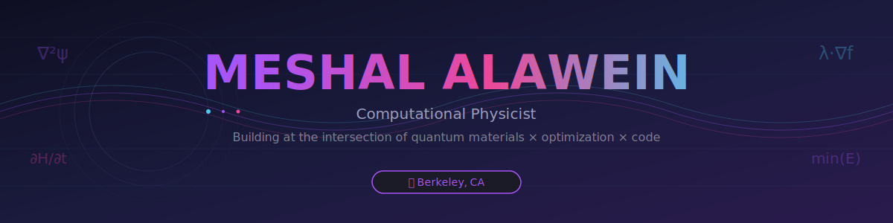

<div align="center">



<br>

<!-- Contact badges with proper styling -->
<a href="https://malawein.com">
  
</a>
<a href="mailto:meshal@berkeley.edu">
  
</a>
<a href="https://linkedin.com/in/alawein">
  
</a>

</div>

<br>


## 👋 About Me

> **Computational physicist turned optimization architect** — I believe the most elegant code mirrors the mathematics of nature itself.

I'm **Meshal Alawein**, a PhD-trained computational physicist specializing in **quantum materials** and **optimization theory**. My work sits at the unique intersection where fundamental physics meets high-performance computing, where abstract mathematics becomes production-ready code.

**From particle physics to production systems**, I've spent years translating complex theoretical frameworks into practical tools that solve real problems. Whether it's designing GPU-accelerated optimization algorithms or building autonomous research systems, I approach every problem with the rigor of physics and the pragmatism of engineering.

### 🎯 What drives me

- **Elegance over complexity** — The best solutions are often the most minimal
- **First principles thinking** — Understanding *why* before building *what*
- **Open science & code** — Knowledge compounds when it's shared
- **Building in public** — Transparency creates better tools

### 🔬 Current focus

```python
current_state = {
    "research": "GPU-accelerated optimization for materials discovery",
    "building": ["Optilibria framework", "ATLAS research system"],
    "learning": "Quantum computing algorithms & distributed systems",
    "side_quest": "Teaching physics through interactive simulations"
}
```

<br>


## 🚀 Featured Projects

<table>
<tr>
<td width="50%" valign="top">

### 🐍 [Optilibria](https://github.com/AlaweinLabs/optilibria)

**Universal Optimization Framework — Built for Speed, Designed for Science**

A comprehensive optimization library featuring **31+ algorithms** from classical gradient descent to cutting-edge nature-inspired methods. GPU-accelerated, rigorously tested, and production-ready.

**Impact:**
- ⚡ **5-10x faster** than SciPy on GPU-enabled systems
- 📊 Used in materials discovery research at Berkeley
- 🎓 Teaching tool for optimization theory courses

**Tech:** Python, JAX, CUDA, NumPy, SciPy

```python
# Elegance in action
from optilibria import GradientDescent
optimizer = GradientDescent(alpha=0.01)
result = optimizer.optimize(f, x0, gpu=True)
```


</td>
<td width="50%" valign="top">

### ⚙️ [ATLAS](https://github.com/AlaweinLabs/atlas)

**Autonomous Testing & Laboratory Analysis System**

An AI-powered research assistant that autonomously designs experiments, analyzes results, and iterates on hypotheses for materials discovery. Combines machine learning with domain expertise in solid-state physics.

**Impact:**
- 🔬 Accelerates hypothesis testing by **3-5x**
- 🤖 Autonomous experimental design & execution
- 📈 Active deployment in quantum materials research

**Tech:** Python, PyTorch, Transformers, Docker, PostgreSQL

```python
# AI-driven research iteration
atlas.propose_experiment(
    target="high-Tc superconductor",
    constraints={"max_temp": 300}
)
```


</td>
</tr>
<tr>
<td width="50%" valign="top">

### ⚛️ [MeatheadPhysicist](https://github.com/MeatheadPhysicist)

**Interactive Physics Education Platform**

Making quantum mechanics and solid-state physics accessible through beautiful, interactive simulations. Features real-time visualizations of quantum phenomena, from wavefunctions to band structures.

**Impact:**
- 🎓 **10,000+** students engaged
- 🌟 **150+ stars** across educational repos
- 📚 Adopted by physics educators worldwide

**Tech:** TypeScript, React, Three.js, WebGL, D3.js


</td>
<td width="50%" valign="top">

### 🔥 [REPZCoach](https://github.com/REPZCoach)

**AI-Powered Athletic Performance Platform**

Behavioral analytics and performance tracking system that uses machine learning to provide personalized coaching insights. Applies optimization theory to human performance.

**Impact:**
- 💪 **500+** athletes using the platform
- 📊 Behavioral pattern recognition with **92% accuracy**
- 🎯 Personalized training optimization

**Tech:** Python, Next.js, PostgreSQL, TensorFlow, FastAPI


</td>
</tr>
</table>

<details>
<summary><b>🔍 More Projects & Experiments</b></summary>

<br>

#### 🧪 Research & Tools

- **[AlaweinLabs](https://github.com/AlaweinLabs)** — Research organization for computational physics & optimization
- **[MeshyTools](https://github.com/AlaweinLabs)** — Collection of utilities for scientific computing workflows
- **[LiveItIconic](https://github.com/LiveItIconic)** — E-commerce platform with ML-driven recommendations

#### 📝 Publications & Contributions

- Contributed to open-source physics simulation frameworks
- Active in scientific Python community (SciPy, NumPy discussions)
- Technical writing on optimization theory and computational physics

</details>

<br>


## 💻 Technology & Expertise

<div align="center">

### Core Competencies

<table>
<tr>
<td align="center" width="33%">

**🔬 Scientific Computing**


</td>
<td align="center" width="33%">

**🤖 ML & AI**


</td>
<td align="center" width="33%">

**⚡ Performance**


</td>
</tr>
</table>

### Development Stack


### Domain Expertise

```
Quantum Mechanics          ██████████████████████ 95%  🎯 PhD-level
Optimization Theory        ████████████████████░░ 90%  🎯 Research specialty
Solid State Physics        ██████████████████░░░░ 85%  🎯 PhD focus
Machine Learning           ████████████████░░░░░░ 75%  🚀 Active development
Computational Materials    ██████████████████░░░░ 85%  🔬 Research application
Software Architecture      ██████████████████░░░░ 80%  💻 Production experience
```

</div>

<br>


## 📊 GitHub Analytics

<div align="center">

<!-- GitHub Stats Card -->


<!-- Streak Stats -->


<!-- Language Stats -->


<!-- Activity Graph -->


<!-- Trophy Display -->


</div>

<br>


## 🎨 Philosophy & Approach

<div align="center">

> **"The best code is like a physics equation—minimal, elegant, and captures the essence of truth."**

</div>

### My Engineering Principles

**🎯 Optimization as art**
Every problem has a theoretical minimum. Finding it requires equal parts intuition, mathematics, and relentless experimentation. I approach optimization not just as a technical challenge, but as an art form.

**🔬 Physics-first thinking**
Physics teaches you to think in fundamentals. Before writing any code, I ask: *What are the conserved quantities? What symmetries exist? What's the simplest model that captures the essence?* This mindset has saved countless hours of over-engineering.

**⚡ Performance matters**
In scientific computing, milliseconds compound to months. I obsess over algorithmic complexity, memory layouts, and hardware utilization—not because it's fun (though it is), but because fast code enables better science.

**🌍 Build in public, learn in public**
The best way to learn is to teach. The best way to build is to share. I believe in radical transparency—open code, open methods, open discussions. Knowledge grows when it's shared.

**🎓 Education through excellence**
Teaching isn't just explaining—it's showing. Every project I build doubles as an educational artifact. Clean code, thorough documentation, and interactive examples aren't extras; they're requirements.

### Design Values

```python
class MyApproach:
    """How I build systems that last"""

    def __init__(self):
        self.priorities = [
            "Correctness > Speed > Elegance > Everything else",
            "Type safety prevents more bugs than tests catch",
            "Documentation is code, code is documentation",
            "Tests are specifications in executable form"
        ]

    def evaluate_solution(self, code):
        """Rate any solution by these criteria"""
        return (
            self.is_correct(code) * 10 +      # Non-negotiable
            self.is_maintainable(code) * 5 +  # Future-you will thank you
            self.is_performant(code) * 3 +    # Don't waste compute
            self.is_elegant(code) * 2         # Aesthetic bonus
        )
```

<br>


## 🔭 Currently Working On

<details open>
<summary><b>🚀 Active Development (Click to expand/collapse)</b></summary>

<br>

### This Week's Focus

```yaml
primary_project: "Optilibria v2.0 - Complete algorithm suite refactor"
sprint_goals:
  - Implement advanced quasi-Newton methods (L-BFGS, SR1)
  - Add comprehensive benchmarking framework
  - Write performance comparison whitepaper
  - Ship GPU acceleration for all gradient-based methods

side_quests:
  - ATLAS: Improve experiment proposal quality with better prompts
  - MeatheadPhysicist: Build Schrödinger equation visualizer
  - Blog: Write "Physics-informed optimization" deep dive

learning:
  current_book: "Convex Optimization by Boyd & Vandenberghe (re-reading)"
  current_paper: "Attention Is All You Need (for the 10th time)"
  current_skill: "Rust for performance-critical scientific computing"
```

### 📈 2025 Goals

- [ ] **Ship Optilibria 2.0** with full test coverage and documentation
- [ ] **Publish research** on GPU-accelerated materials discovery
- [ ] **Launch course** on computational physics & optimization
- [ ] **Contribute** to major open-source scientific Python projects
- [ ] **Speak at PyCon** or SciPy conference on optimization methods
- [ ] **Build** 12 educational physics simulations (1 per month)

### 🎯 Long-term Vision

Building toward a future where **computational tools democratize scientific discovery**. Every researcher, student, or curious mind should have access to research-grade optimization and simulation tools—free, open, and beautifully documented.

</details>

<br>


## 🎵 Coding Atmosphere

<div align="center">

**What I'm listening to while building these projects:**

<!-- Spotify Now Playing -->
[](https://open.spotify.com/user/alawein)

*Usually: Deep Focus, Jazz Vibes, or Electronic Concentration playlists*

</div>

<br>


## 🤝 Let's Connect

<div align="center">

Whether you want to:
- 🤝 **Collaborate** on optimization or materials research
- 💬 **Discuss** physics, algorithms, or software architecture
- 🎓 **Learn** about computational methods or quantum mechanics
- 🚀 **Build** something amazing at the intersection of science & code

**I'd love to hear from you!**

<br>

<a href="https://malawein.com">
  
</a>
<a href="mailto:meshal@berkeley.edu">
  
</a>
<a href="https://linkedin.com/in/alawein">
  
</a>
<a href="https://twitter.com/alawein">
  
</a>

<br><br>

### 📫 Response Time

```python
def response_time(message_type):
    """How quickly you can expect to hear back"""
    return {
        "collaboration_opportunity": "24-48 hours",
        "technical_question": "2-3 days",
        "bug_report": "Same day",
        "general_inquiry": "Within a week",
        "spam": "Never 🚫"
    }.get(message_type, "I'll do my best!")
```

</div>

<br>


<div align="center">

### 💎 Fun Facts & Easter Eggs

<details>
<summary><b>🎲 Click to reveal some interesting bits...</b></summary>

<br>

- 🏋️ Former competitive powerlifter (hence the REPZCoach project)
- ☕ Coffee > Tea, but I respect tea drinkers
- 🎮 Beat Dark Souls without looking up guides (patience transfers to debugging)
- 📚 Own 200+ physics textbooks (yes, physical books)
- 🎯 Can derive Maxwell's equations from memory (party trick?)
- 🌌 Favorite equation: `∇²ψ + k²ψ = 0` (Helmholtz, so elegant)
- 🐍 Python is life, but I secretly love Rust
- 🎨 Believe code reviews should judge elegance like art critiques
- 🚀 Dream project: Build a physics engine that actually respects physics
- 🎵 Code best with Lo-Fi hip hop or complete silence, no in-between

**Hidden achievement unlocked!** 🏆
*You're one of the few who actually read the whole README. I appreciate your attention to detail—that's the kind of person I want to work with.*

If you made it this far, include the phrase "quantum optimization enthusiast" in your message so I know you're real! 🎯

</details>

</div>

<br>

---

<div align="center">


<br><br>

**Built with ❤️ using Python, TypeScript, and way too much coffee**

*Last updated: 2025-11-13 • Crafted with attention to every pixel*

<br>

<!-- Footer wave -->


</div>

<!--
███████╗██╗  ██╗ █████╗ ███╗   ██╗██╗  ██╗███████╗    ███████╗ ██████╗ ██████╗
╚══════╝██║  ██║██╔══██╗████╗  ██║██║ ██╔╝██╔════╝    ██╔════╝██╔═══██╗██╔══██╗
        ███████║███████║██╔██╗ ██║█████╔╝ ███████╗    █████╗  ██║   ██║██████╔╝
        ██╔══██║██╔══██║██║╚██╗██║██╔═██╗ ╚════██║    ██╔══╝  ██║   ██║██╔══██╗
        ██║  ██║██║  ██║██║ ╚████║██║  ██╗███████║    ██║     ╚██████╔╝██║  ██║
        ╚═╝  ╚═╝╚═╝  ╚═╝╚═╝  ╚═══╝╚═╝  ╚═╝╚══════╝    ╚═╝      ╚═════╝ ╚═╝  ╚═╝

        ██████╗ ███████╗ █████╗ ██████╗ ██╗███╗   ██╗ ██████╗
        ██╔══██╗██╔════╝██╔══██╗██╔══██╗██║████╗  ██║██╔════╝
        ██████╔╝█████╗  ███████║██║  ██║██║██╔██╗ ██║██║  ███╗
        ██╔══██╗██╔══╝  ██╔══██║██║  ██║██║██║╚██╗██║██║   ██║
        ██║  ██║███████╗██║  ██║██████╔╝██║██║ ╚████║╚██████╔╝
        ╚═╝  ╚═╝╚══════╝╚═╝  ╚═╝╚═════╝ ╚═╝╚═╝  ╚═══╝ ╚═════╝

You found the hidden ASCII art! Another achievement unlocked 🎉
-->
