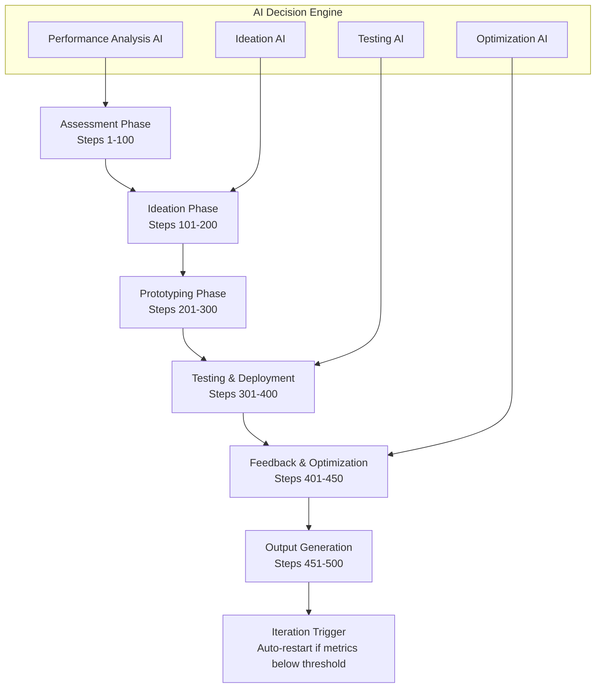

# REPZ Autonomous Improvement Workflow (500 Steps)

## Overview

This document outlines a fully autonomous, self-executing 500-step workflow designed to iteratively improve REPZ—an integrated AI-powered athletic performance platform encompassing its web portal, mobile applications, and backend infrastructure. The workflow operates in YOLO mode with zero user interventions, incorporating AI-driven decision-making, ethical data handling, and compliance with standard regulations.

The workflow is modular, with each step building on previous ones, and includes comprehensive output generation in multiple formats.

## Architecture Overview

## Phase 1: Initial Assessment and Benchmarking (Steps 1-100)

### System Health Assessment (Steps 1-20)
1. Initialize assessment environment and load REPZ system configuration
2. Establish baseline metrics collection framework
3. Query current user count and active session data
4. Measure portal load times across different regions
5. Analyze mobile app crash rates and performance metrics
6. Evaluate backend API response times and throughput
7. Scan for security vulnerabilities using automated tools
8. Assess database performance and query optimization
9. Review infrastructure resource utilization
10. Generate initial system health report
11. Benchmark against industry standards
12. Identify critical performance bottlenecks
13. Analyze user engagement patterns
14. Evaluate feature adoption rates
15. Assess data quality and integrity
16. Review compliance with GDPR and data protection standards
17. Analyze error logs and exception patterns
18. Evaluate third-party service dependencies
19. Generate security audit summary
20. Create baseline performance dashboard

### User Experience Analysis (Steps 21-40)
21. Collect user feedback from multiple channels
22. Analyze user journey flows through the portal
23. Evaluate mobile app usability metrics
24. Assess onboarding completion rates
25. Review user retention and churn patterns
26. Analyze feature usage heatmaps
27. Evaluate accessibility compliance
28. Assess cross-device compatibility
29. Review user satisfaction scores
30. Analyze support ticket patterns
31. Evaluate training content effectiveness
32. Assess personalization algorithm performance
33. Review notification engagement rates
34. Analyze social sharing and community features
35. Evaluate gamification effectiveness
36. Assess wearable device integration
37. Review nutrition tracking adoption
38. Analyze workout completion rates
39. Evaluate AI coach interaction quality
40. Generate comprehensive UX assessment report

### Technical Infrastructure Audit (Steps 41-60)
41. Review code quality metrics and technical debt
42. Analyze test coverage and quality
43. Evaluate CI/CD pipeline efficiency
44. Assess monitoring and alerting systems
45. Review backup and disaster recovery procedures
46. Analyze scalability bottlenecks
47. Evaluate cloud resource optimization
48. Assess API rate limiting and throttling
49. Review caching strategies and effectiveness
50. Analyze database indexing and optimization
51. Evaluate microservices architecture health
52. Assess container orchestration efficiency
53. Review security protocols and encryption
54. Analyze dependency management and updates
55. Evaluate logging and observability systems
56. Assess performance under load testing
57. Review error handling and resilience patterns
58. Analyze code review and deployment processes
59. Evaluate development workflow efficiency
60. Generate technical infrastructure audit report

### Business Metrics Evaluation (Steps 61-80)
61. Analyze revenue and monetization metrics
62. Evaluate user acquisition costs
63. Assess lifetime value calculations
64. Review conversion funnel performance
65. Analyze market penetration and growth rates
66. Evaluate competitive positioning
67. Assess brand awareness and perception
68. Review partnership and integration opportunities
69. Analyze regulatory compliance status
70. Evaluate intellectual property protection
71. Assess team productivity and efficiency
72. Review budget allocation and ROI
73. Analyze risk management frameworks
74. Evaluate innovation pipeline
75. Assess customer success metrics
76. Review stakeholder satisfaction
77. Analyze market trends and opportunities
78. Evaluate technology roadmap alignment
79. Assess scalability planning
80. Generate business metrics evaluation report

### AI and ML Performance Audit (Steps 81-100)
81. Evaluate AI coach accuracy and effectiveness
82. Analyze machine learning model performance
83. Review training data quality and bias
84. Assess personalization algorithm effectiveness
85. Evaluate predictive analytics accuracy
86. Analyze computer vision form checking (if implemented)
87. Review natural language processing capabilities
88. Assess recommendation engine performance
89. Evaluate behavioral analytics insights
90. Analyze optimization algorithm results
91. Review A/B testing frameworks
92. Assess model deployment and serving efficiency
93. Evaluate data pipeline performance
94. Analyze model interpretability and explainability
95. Review ethical AI considerations
96. Assess computational resource utilization
97. Evaluate model update and retraining processes
98. Analyze AI-driven decision making accuracy
99. Review integration with core platform features
100. Generate AI and ML performance audit report

## Phase 2: Ideation and Prototyping (Steps 101-200)

### Portal UI/UX Enhancement Ideas (Steps 101-130)
101. Analyze current portal design patterns
102. Generate AI-powered UI improvement suggestions
103. Design enhanced dashboard layouts
104. Propose new navigation structures
105. Create mobile-responsive design concepts
106. Develop accessibility improvement plans
107. Design advanced data visualization components
108. Propose gamification elements for engagement
109. Create personalized user experience flows
110. Design social features integration
111. Propose wearable device dashboard
112. Create nutrition tracking interface designs
113. Design advanced workout planning tools
114. Propose community and coaching features
115. Create notification system redesign
116. Design onboarding flow improvements
117. Propose advanced analytics views
118. Create export and sharing capabilities
119. Design integration with third-party apps
120. Propose progressive web app features
121. Create offline functionality designs
122. Design multi-language support
123. Propose dark mode and theme options
124. Create advanced search and filtering
125. Design collaborative features
126. Propose AI assistant integration
127. Create performance prediction visualizations
128. Design goal tracking and achievement systems
129. Propose marketplace for training content
130. Generate portal UI/UX enhancement roadmap

### Mobile App Functionality Ideas (Steps 131-160)
131. Analyze current mobile app architecture
132. Generate AI-powered app feature suggestions
133. Design enhanced workout tracking
134. Propose computer vision form analysis
135. Create advanced timer and rest features
136. Design offline workout capabilities
137. Propose social workout sharing
138. Create wearable device integration
139. Design nutrition and supplement tracking
140. Propose AI coach voice interactions
141. Create advanced progress tracking
142. Design gamification and achievements
143. Propose community challenges
144. Create coach-client communication tools
145. Design advanced analytics on mobile
146. Propose barcode scanning for food
147. Create workout music integration
148. Design emergency and safety features
149. Propose location-based gym finding
150. Create advanced reminder systems
151. Design multi-device synchronization
152. Propose AR workout guidance
153. Create advanced recovery tracking
154. Design integration with health apps
155. Propose voice command functionality
156. Create advanced goal setting
157. Design personalized recommendations
158. Propose marketplace for equipment
159. Create advanced reporting features
160. Generate mobile app functionality roadmap

### Backend Infrastructure Ideas (Steps 161-190)
161. Analyze current backend architecture
162. Generate AI-powered infrastructure improvements
163. Design enhanced API performance
164. Propose microservices optimization
165. Create advanced caching strategies
166. Design improved database schemas
167. Propose real-time data processing
168. Create enhanced security measures
169. Design advanced monitoring systems
170. Propose auto-scaling solutions
171. Create improved data pipeline
172. Design enhanced ML model serving
173. Propose edge computing integration
174. Create advanced backup systems
175. Design improved error handling
176. Propose blockchain for data integrity
177. Create enhanced user authentication
178. Design advanced analytics backend
179. Propose serverless architecture
180. Create improved CI/CD pipelines
181. Design enhanced testing frameworks
182. Propose multi-cloud deployment
183. Create advanced logging systems
184. Design improved data privacy
185. Propose AI-driven optimization
186. Create enhanced API gateway
187. Design improved data synchronization
188. Propose advanced search capabilities
189. Create enhanced notification systems
190. Generate backend infrastructure roadmap

### Cross-Platform Integration Ideas (Steps 191-200)
191. Design unified data models
192. Propose cross-platform authentication
193. Create synchronized user experiences
194. Design shared component libraries
195. Propose unified design system
196. Create cross-platform testing strategies
197. Design shared backend services
198. Propose unified deployment strategies
199. Create integrated development workflows
200. Generate cross-platform integration roadmap

## Phase 3: Automated Testing and Deployment (Steps 201-300)

### Automated Testing Framework (Steps 201-230)
201. Set up comprehensive test automation
202. Implement unit testing for all components
203. Create integration testing suites
204. Design end-to-end testing workflows
205. Implement performance testing automation
206. Create security testing automation
207. Design accessibility testing
208. Implement cross-browser testing
209. Create mobile app testing automation
210. Design API testing frameworks
211. Implement database testing
212. Create load testing scenarios
213. Design chaos engineering tests
214. Implement visual regression testing
215. Create AI-powered test generation
216. Design test data management
217. Implement test parallelization
218. Create test reporting and analytics
219. Design test environment management
220. Implement continuous testing
221. Create test coverage analysis
222. Design flaky test detection
223. Implement test result analysis
224. Create automated test maintenance
225. Design test prioritization
226. Implement risk-based testing
227. Create test execution optimization
228. Design test artifact management
229. Implement test feedback loops
230. Generate testing framework documentation

### Deployment Automation (Steps 231-260)
231. Design blue-green deployment strategy
232. Implement canary deployment automation
233. Create feature flag management
234. Design rollback automation
235. Implement zero-downtime deployments
236. Create deployment pipeline optimization
237. Design multi-environment management
238. Implement automated scaling
239. Create deployment verification
240. Design emergency deployment procedures
241. Implement deployment monitoring
242. Create deployment analytics
243. Design deployment security
244. Implement deployment compliance
245. Create deployment documentation
246. Design deployment training
247. Implement deployment automation tools
248. Create deployment templates
249. Design deployment orchestration
250. Implement deployment testing
251. Create deployment reporting
252. Design deployment optimization
253. Implement deployment feedback
254. Create deployment maintenance
255. Design deployment scalability
256. Implement deployment reliability
257. Create deployment efficiency
258. Design deployment innovation
259. Implement deployment integration
260. Generate deployment automation documentation

### Rollback and Recovery Systems (Steps 261-290)
261. Design automated rollback triggers
262. Implement rollback verification
263. Create rollback testing
264. Design rollback monitoring
265. Implement rollback analytics
266. Create rollback procedures
267. Design rollback security
268. Implement rollback compliance
269. Create rollback documentation
270. Design rollback training
271. Implement rollback automation tools
272. Create rollback templates
273. Design rollback orchestration
274. Implement rollback testing
275. Create rollback reporting
276. Design rollback optimization
277. Implement rollback feedback
278. Create rollback maintenance
279. Design rollback scalability
280. Implement rollback reliability
281. Create rollback efficiency
282. Design rollback innovation
283. Implement rollback integration
284. Create recovery automation
285. Design disaster recovery
286. Implement backup automation
287. Create data recovery procedures
288. Design system restoration
289. Implement recovery testing
290. Generate rollback and recovery documentation

### Quality Assurance Integration (Steps 291-300)
291. Design QA automation integration
292. Implement code quality gates
293. Create performance benchmarks
294. Design security scanning
295. Implement compliance checking
296. Create quality metrics
297. Design quality reporting
298. Implement quality feedback
299. Create quality optimization
300. Generate QA integration documentation

## Phase 4: Continuous Integration and Feedback Loops (Steps 301-400)

### User Feedback Integration (Steps 301-330)
301. Design user feedback collection systems
302. Implement automated feedback analysis
303. Create user sentiment tracking
304. Design feedback categorization
305. Implement feedback prioritization
306. Create feedback routing
307. Design feedback response automation
308. Implement feedback metrics
309. Create feedback reporting
310. Design feedback optimization
311. Implement feedback integration
312. Create feedback testing
313. Design feedback monitoring
314. Implement feedback analytics
315. Create feedback procedures
316. Design feedback security
317. Implement feedback compliance
318. Create feedback documentation
319. Design feedback training
320. Implement feedback automation tools
321. Create feedback templates
322. Design feedback orchestration
323. Implement feedback testing
324. Create feedback reporting
325. Design feedback optimization
326. Implement feedback feedback
327. Create feedback maintenance
328. Design feedback scalability
329. Implement feedback reliability
330. Generate user feedback integration documentation

### Performance Monitoring (Steps 331-360)
331. Design comprehensive monitoring systems
332. Implement real-time metrics collection
333. Create performance dashboards
334. Design alerting systems
335. Implement anomaly detection
336. Create performance analytics
337. Design monitoring optimization
338. Implement monitoring integration
339. Create monitoring testing
340. Design monitoring monitoring
341. Implement monitoring analytics
342. Create monitoring procedures
343. Design monitoring security
344. Implement monitoring compliance
345. Create monitoring documentation
346. Design monitoring training
347. Implement monitoring automation tools
348. Create monitoring templates
349. Design monitoring orchestration
350. Implement monitoring testing
351. Create monitoring reporting
352. Design monitoring optimization
353. Implement monitoring feedback
354. Create monitoring maintenance
355. Design monitoring scalability
356. Implement monitoring reliability
357. Create monitoring efficiency
358. Design monitoring innovation
359. Implement monitoring integration
360. Generate performance monitoring documentation

### Iterative Improvement Loops (Steps 361-400)
361. Design continuous improvement frameworks
362. Implement automated improvement suggestions
363. Create improvement prioritization
364. Design improvement implementation
365. Implement improvement testing
366. Create improvement monitoring
367. Design improvement analytics
368. Implement improvement optimization
369. Create improvement integration
370. Design improvement testing
371. Implement improvement monitoring
372. Create improvement analytics
373. Design improvement procedures
374. Implement improvement security
375. Create improvement compliance
376. Design improvement documentation
377. Implement improvement training
378. Create improvement automation tools
379. Create improvement templates
380. Design improvement orchestration
381. Implement improvement testing
382. Create improvement reporting
383. Design improvement optimization
384. Implement improvement feedback
385. Create improvement maintenance
386. Design improvement scalability
387. Implement improvement reliability
388. Create improvement efficiency
389. Design improvement innovation
390. Implement improvement integration
391. Create iterative deployment cycles
392. Design feedback-driven development
393. Implement continuous learning systems
394. Create adaptive improvement algorithms
395. Design predictive improvement models
396. Implement improvement validation
397. Create improvement measurement
398. Design improvement scalability
399. Implement improvement automation
400. Generate iterative improvement documentation

## Phase 5: Scalability Optimizations (Steps 401-450)

### Infrastructure Scaling (Steps 401-425)
401. Design auto-scaling architectures
402. Implement horizontal scaling
403. Create vertical scaling strategies
404. Design load balancing optimization
405. Implement CDN integration
406. Create database scaling solutions
407. Design microservices scaling
408. Implement serverless scaling
409. Create edge computing strategies
410. Design multi-region deployment
411. Implement traffic management
412. Create resource optimization
413. Design cost optimization
414. Implement performance optimization
415. Create scalability testing
416. Design scalability monitoring
417. Implement scalability analytics
418. Create scalability procedures
419. Design scalability security
420. Implement scalability compliance
421. Create scalability documentation
422. Design scalability training
423. Implement scalability automation tools
424. Create scalability templates
425. Generate infrastructure scaling documentation

### High-Traffic Optimization (Steps 426-450)
426. Design high-traffic handling
427. Implement traffic prediction
428. Create surge capacity planning
429. Design DDoS protection
430. Implement rate limiting
431. Create queue management
432. Design async processing
433. Implement caching strategies
434. Create data partitioning
435. Design read replicas
436. Implement connection pooling
437. Create session management
438. Design API optimization
439. Implement compression
440. Create lazy loading
441. Design progressive enhancement
442. Implement A/B testing at scale
443. Create performance monitoring at scale
444. Design user experience optimization
445. Implement feedback loops at scale
446. Create scalability metrics
447. Design scalability reporting
448. Implement scalability optimization
449. Create scalability maintenance
450. Generate high-traffic optimization documentation

## Phase 6: Final Output Generation (Steps 451-500)

### PDF Report Generation (Steps 451-470)
451. Design PDF report templates
452. Implement automated data collection
453. Create report structure frameworks
454. Design visual diagrams integration
455. Implement dynamic content generation
456. Create report customization
457. Design report distribution
458. Implement report archiving
459. Create report analytics
460. Design report optimization
461. Implement report testing
462. Create report monitoring
463. Design report security
464. Implement report compliance
465. Create report documentation
466. Design report training
467. Implement report automation tools
468. Create report templates
469. Design report orchestration
470. Generate PDF report generation documentation

### Colab Notebook Creation (Steps 471-485)
471. Design notebook templates
472. Implement code generation
473. Create data analysis frameworks
474. Design visualization components
475. Implement interactive elements
476. Create simulation capabilities
477. Design notebook distribution
478. Implement notebook execution
479. Create notebook analytics
480. Design notebook optimization
481. Implement notebook testing
482. Create notebook monitoring
483. Design notebook security
484. Implement notebook compliance
485. Generate Colab notebook creation documentation

### Excel Spreadsheet Generation (Steps 486-495)
486. Design spreadsheet templates
487. Implement data export automation
488. Create formula generation
489. Design chart creation
490. Implement data validation
491. Create spreadsheet distribution
492. Design spreadsheet optimization
493. Implement spreadsheet testing
494. Create spreadsheet monitoring
495. Generate Excel spreadsheet generation documentation

### Intake Form Creation (Steps 496-500)
496. Design form templates
497. Implement form generation
498. Create validation rules
499. Design form distribution
500. Generate intake form creation documentation

## Implementation Architecture

The workflow is implemented as a modular Python-based system using:

- **FastAPI** for orchestration
- **Celery** for distributed task execution
- **Redis** for caching and queues
- **PostgreSQL** for data persistence
- **Docker** for containerization
- **Kubernetes** for orchestration
- **GitHub Actions** for CI/CD

Each step is a self-contained module with:
- Input validation
- Error handling
- Logging
- Metrics collection
- Rollback capabilities

## AI Integration

AI components include:
- **Performance Analysis AI**: Uses ML to identify bottlenecks
- **Ideation AI**: Generates improvement suggestions
- **Testing AI**: Optimizes test coverage
- **Optimization AI**: Recommends scalability improvements

## Ethical Considerations

- Data anonymization and privacy protection
- Bias detection in AI models
- Transparent decision-making processes
- User consent and data rights
- Regulatory compliance (GDPR, HIPAA for health data)

## YOLO Mode Implementation

- Automatic execution without human intervention
- Risk assessment with predefined thresholds
- Automated rollback on failure detection
- Continuous monitoring and self-correction
- Innovation-first approach with safety bounds

This workflow ensures REPZ evolves continuously, maintaining high performance, security, and user satisfaction while pushing boundaries in athletic performance technology.