# AI Orchestration & Feedback System

## Overview

This system creates a continuous feedback loop between AI coding tools, governance workflows, and developer experience.

```
┌─────────────────────────────────────────────────────────────────────────────┐
│                        AI ORCHESTRATION FEEDBACK LOOP                       │
├─────────────────────────────────────────────────────────────────────────────┤
│                                                                             │
│  ┌─────────────┐    ┌─────────────┐    ┌─────────────┐    ┌─────────────┐  │
│  │   CONTEXT   │───►│    TASK     │───►│  EXECUTION  │───►│  FEEDBACK   │  │
│  │  INJECTION  │    │ SUBMISSION  │    │   & SYNC    │    │ COLLECTION  │  │
│  └─────────────┘    └─────────────┘    └─────────────┘    └─────────────┘  │
│         ▲                                                        │          │
│         │                                                        │          │
│         │              ┌─────────────┐                           │          │
│         └──────────────│   METRICS   │◄──────────────────────────┘          │
│                        │  & LEARNING │                                      │
│                        └─────────────┘                                      │
│                                                                             │
└─────────────────────────────────────────────────────────────────────────────┘
```

## Components

### 1. Context Injection Layer

AI tools receive structured context about the codebase:

```yaml
# .ai/context.yaml
codemap: docs/CODEMAP.md
architecture: docs/ARCHITECTURE.md
policies: .metaHub/policies/
templates: templates/devops/
recent_changes: .ai/recent-changes.json
task_history: .ai/task-history.json
```

### 2. Task Submission System

```
User Request → Task Parser → Priority Queue → AI Agent → Execution → Feedback
```

### 3. Sync Mechanism

```
Local Changes → Pre-commit Hooks → CI Validation → Governance Check → Merge
      ↓                                                    ↓
AI Feedback ←──────────────────────────────────────── Metrics Update
```

### 4. Feedback Collection

- PR comments analysis
- Task completion metrics
- Error patterns
- Time-to-resolution
- Code quality delta

### 5. Metrics & Learning

- Task success rate
- AI suggestion acceptance rate
- Governance compliance score
- Codemap accuracy
- Developer satisfaction

---

## Architecture Diagram

```mermaid
flowchart TB
    subgraph Input["📥 Input Layer"]
        user[User Request]
        pr[PR/Issue]
        schedule[Scheduled Task]
    end

    subgraph Context["🧠 Context Layer"]
        codemap[Codemap]
        arch[Architecture]
        history[Task History]
        metrics[Metrics]
    end

    subgraph Orchestration["⚙️ Orchestration Layer"]
        parser[Task Parser]
        router[AI Router]
        queue[Priority Queue]
    end

    subgraph Execution["🔧 Execution Layer"]
        claude[Claude Code]
        kilo[Kilo Code]
        cursor[Cursor]
        copilot[Copilot]
    end

    subgraph Validation["✅ Validation Layer"]
        precommit[Pre-commit]
        ci[CI/CD]
        governance[Governance]
    end

    subgraph Feedback["📊 Feedback Layer"]
        collector[Feedback Collector]
        analyzer[Pattern Analyzer]
        optimizer[Optimizer]
    end

    Input --> parser
    Context --> router
    parser --> router --> queue --> Execution
    Execution --> Validation
    Validation --> collector
    collector --> analyzer --> optimizer
    optimizer --> Context
```



---

## File Structure

```
.ai/
├── context.yaml           # AI context configuration
├── task-history.json      # Completed tasks log
├── recent-changes.json    # Recent codebase changes
├── metrics.json           # AI effectiveness metrics
├── feedback/              # Collected feedback
│   ├── pr-comments.json
│   ├── task-outcomes.json
│   └── suggestions.json
└── prompts/               # Reusable prompt templates
    ├── code-review.md
    ├── bug-fix.md
    └── feature-impl.md
```

---

## Integration Points

### Claude Code (CLAUDE.md)

```markdown
## AI Context

Before starting any task:

1. Read .ai/context.yaml for current state
2. Check .ai/task-history.json for similar tasks
3. Review docs/CODEMAP.md for system understanding
4. Log task start in .ai/current-task.json
```

### Kilo Code (.kilorc)

```json
{
  "context_files": [".ai/context.yaml", "docs/CODEMAP.md"],
  "feedback_endpoint": ".ai/feedback/",
  "metrics_tracking": true
}
```

### GitHub Actions

```yaml
on:
  pull_request:
    types: [opened, synchronize]

jobs:
  ai-feedback:
    - name: Collect AI metrics
    - name: Analyze changes
    - name: Update codemap if needed
    - name: Post feedback summary
```

---

## Workflow Examples

### Task Submission Flow

```
1. User: "Add authentication to the API"
   ↓
2. Task Parser extracts:
   - Type: feature
   - Scope: api, auth
   - Complexity: medium
   ↓
3. Context Injection:
   - Related files: tools/api/*, templates/auth/*
   - Similar past tasks: #123, #456
   - Codemap section: API layer
   ↓
4. AI Router selects: Claude Code (complex feature)
   ↓
5. Execution with context
   ↓
6. Validation: pre-commit → CI → governance
   ↓
7. Feedback collected:
   - Time: 45 minutes
   - Files changed: 8
   - Tests added: 12
   - Governance: PASS
```

### Feedback Loop

```
PR #789 merged
   ↓
Feedback Collector gathers:
- Lines of code: +250, -50
- Test coverage: +5%
- Review iterations: 2
- Time to merge: 4 hours
   ↓
Pattern Analyzer identifies:
- Auth tasks take longer (avg 3x)
- Claude better for complex features
- Kilo faster for refactoring
   ↓
Optimizer updates:
- Router weights adjusted
- Context templates refined
- Codemap sections updated
```

---

## Metrics Tracked

| Metric                 | Description                          | Target     |
| ---------------------- | ------------------------------------ | ---------- |
| Task Success Rate      | % of tasks completed without issues  | > 90%      |
| First-Pass Acceptance  | PRs merged without revision          | > 70%      |
| Governance Compliance  | Changes passing all policies         | 100%       |
| Codemap Accuracy       | Codemap reflects actual structure    | > 95%      |
| Context Relevance      | AI uses provided context effectively | > 80%      |
| Time to Resolution     | Average task completion time         | Decreasing |
| Developer Satisfaction | Feedback from developers             | > 4/5      |

---

## Implementation Phases

### Phase 1: Context Foundation (Week 1)

- [ ] Create .ai/ directory structure
- [ ] Implement context.yaml parser
- [ ] Add codemap injection to CLAUDE.md
- [ ] Set up task-history.json logging

### Phase 2: Task System (Week 2)

- [ ] Build task submission workflow
- [ ] Create task parser
- [ ] Implement priority queue
- [ ] Add AI router logic

### Phase 3: Feedback Collection (Week 3)

- [ ] GitHub Action for PR analysis
- [ ] Feedback collector script
- [ ] Pattern analyzer
- [ ] Metrics dashboard

### Phase 4: Optimization (Week 4)

- [ ] Learning algorithm for router
- [ ] Codemap auto-update
- [ ] Context refinement
- [ ] Developer feedback integration

---

## API Reference

### Task Submission

```bash
npm run ai:submit -- --type=feature --scope=auth --description="Add OAuth"
```

### Feedback Query

```bash
npm run ai:metrics -- --range=7d --type=success-rate
```

### Context Update

```bash
npm run ai:sync -- --update-codemap --refresh-history
```
