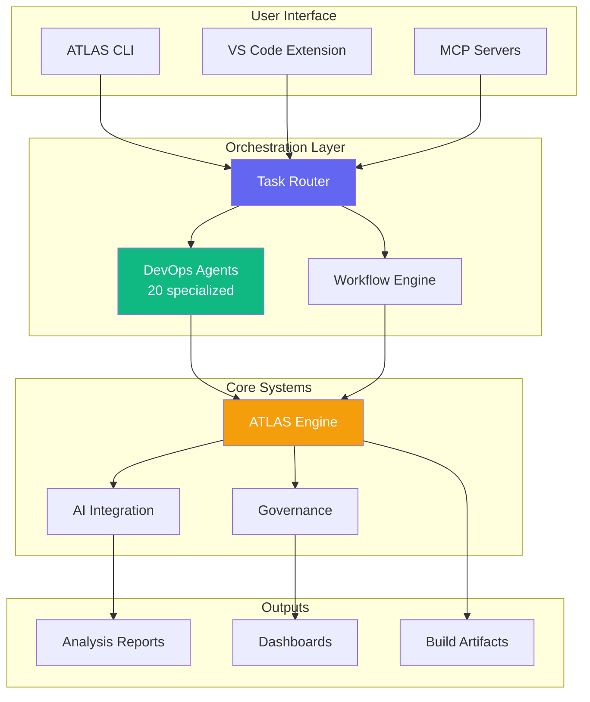
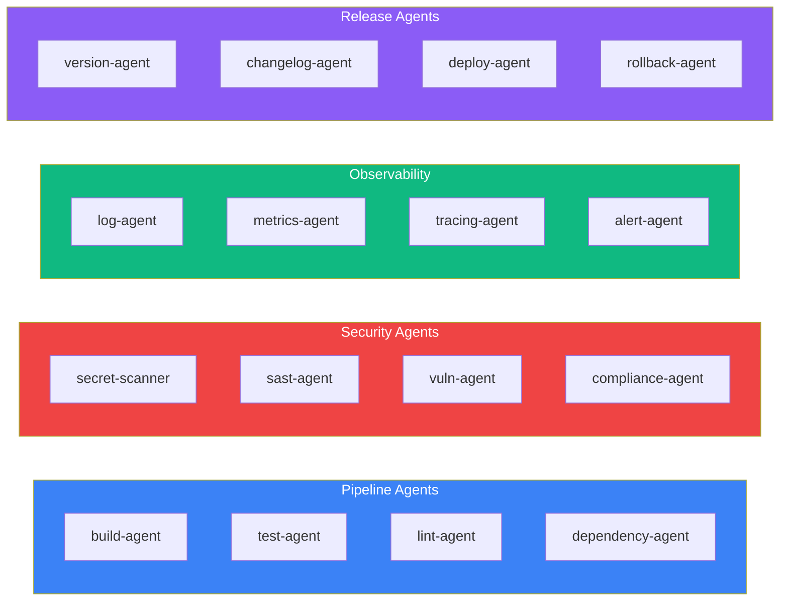
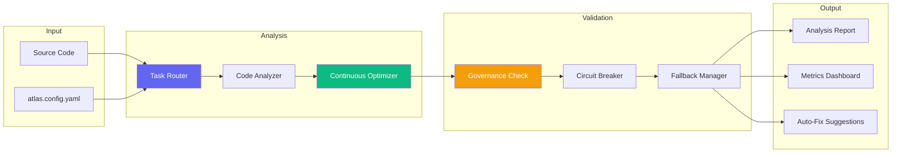
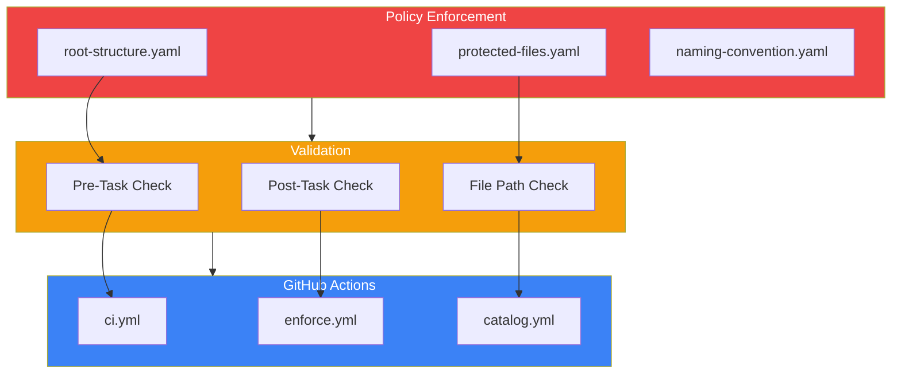

# Repository Codemap

> Simplified architecture after consolidation (v3.1 - Dec 2025)

## Directory Structure

```text
meta-governance/
├── automation/          # Python automation system (agents, workflows)
│   ├── agents/          # AI-powered automation agents
│   ├── cli/             # Python CLI commands
│   ├── orchestration/   # Multi-agent orchestration
│   └── workflows/       # Automation workflow definitions
├── demo/                # Demos, examples, test scenarios
├── docs/                # Documentation (MkDocs source)
├── organizations/       # Organization monorepo templates
├── src/                 # Service implementations
├── tests/               # Unit tests (Vitest + Pytest)
├── tools/               # TypeScript toolkit
│   ├── ai/              # AI orchestration & MCP integration
│   ├── atlas/           # Code analysis & refactoring engine
│   ├── cli/             # Main CLI entry points
│   ├── devops/          # DevOps agents & templates
│   └── scripts/         # Build & utility scripts
├── .ai/                 # AI assistant configurations
├── .atlas/              # ATLAS runtime state & reports
├── .github/             # GitHub Actions & workflows
├── .metaHub/            # Governance policies & catalogs
└── .archive/            # Archived code (historical)
```

## System Architecture



## DevOps Agent System

20 specialized agents organized into 4 categories:



## Pre-built Workflows

```mermaid
flowchart TD
    subgraph CICD["CI/CD Pipeline"]
        lint[lint-agent] --> build[build-agent]
        build --> test[test-agent]
        test --> security[sast-agent]
    end

    subgraph SecureRelease["Secure Release"]
        scan[secret-scanner] --> vuln[vuln-agent]
        vuln --> compliance[compliance-agent]
        compliance --> deploy[deploy-agent]
    end

    subgraph Incident["Incident Response"]
        detect[alert-agent] --> analyze[log-agent]
        analyze --> trace[tracing-agent]
        trace --> recover[rollback-agent]
    end

    style CICD fill:#3B82F6,color:#fff
    style SecureRelease fill:#10B981,color:#fff
    style Incident fill:#EF4444,color:#fff
```



## ATLAS Analysis Flow



## Governance Layer



## Quick Reference

| Component      | Path                                                                                        | Purpose                  |
| -------------- | ------------------------------------------------------------------------------------------- | ------------------------ |
| ATLAS CLI      | [tools/atlas/cli/](../tools/atlas/cli/)                                                     | Main command interface   |
| DevOps Agents  | [tools/atlas/orchestration/devops-agents.ts](../tools/atlas/orchestration/devops-agents.ts) | 20 specialized agents    |
| AI Integration | [tools/ai/](../tools/ai/)                                                                   | MCP servers & AI routing |
| Governance     | [.metaHub/policies/](../.metaHub/policies/)                                                 | Policy definitions       |
| Workflows      | [.github/workflows/](../.github/workflows/)                                                 | CI/CD automation         |
| Tests          | [tests/](../tests/)                                                                         | Unit & integration tests |

## Key Files

```text
CLAUDE.md                    # AI assistant instructions
package.json                 # npm scripts & dependencies
tsconfig.json                # TypeScript configuration
eslint.config.js             # ESLint v9 flat config
vitest.config.ts             # Test runner config
.metaHub/policies/*.yaml     # Governance policies
tools/atlas/cli/commands.ts  # CLI command registry
```

## CLI Commands

```bash
# ATLAS Commands
npm run atlas -- agents       # List DevOps agents
npm run atlas -- workflows    # List available workflows
npm run atlas -- run <name>   # Execute a workflow
npm run atlas -- devops ci    # Run CI/CD pipeline

# Development
npm run lint                  # Run ESLint
npm test                      # Run Vitest tests
npm run build                 # Build TypeScript
```

---

Auto-generated: 2025-12-02 | Structure v3.0
