# Interactive Codemap

> Auto-generated system architecture visualization

## System Overview

```mermaid
flowchart TB
    subgraph User["👤 User"]
        CLI[CLI Commands]
        IDE[IDE/Editor]
    end

    subgraph Core["🔧 Core Tools"]
        devops[tools/cli/devops.ts]
        governance[tools/cli/governance.py]
        atlas[tools/atlas/*]
    end

    subgraph Templates["📦 Templates"]
        cicd[CI/CD]
        k8s[Kubernetes]
        db[Databases]
        iac[IaC]
        monitoring[Monitoring]
    end

    subgraph Automation["⚙️ GitHub Actions"]
        ci[ci.yml]
        catalog[catalog.yml]
        enforce[enforce.yml]
        checkpoint[checkpoint.yml]
    end

    subgraph Output["📊 Output"]
        metahub[.metaHub/]
        reports[enforcement-reports/]
        catalogjson[catalog.json]
    end

    CLI --> devops
    CLI --> governance
    IDE --> atlas

    devops --> Templates
    Templates --> metahub

    governance --> reports
    governance --> catalogjson

    Automation --> governance
    Automation --> devops
```

## CLI Command Flow

## Template Library Structure

## Governance Data Flow

```mermaid
flowchart TB
    subgraph Trigger["Triggers"]
        schedule[⏰ Schedule]
        push[📤 Push Event]
        manual[👆 Manual]
    end

    subgraph Workflows["GitHub Actions"]
        enforce[enforce.yml<br/>Every 6h]
        catalog[catalog.yml<br/>Daily 8AM]
        checkpoint[checkpoint.yml<br/>Weekly]
    end

    subgraph Scanner["Scanner"]
        scan[Scan organizations/**]
        validate[Validate .meta/repo.yaml]
    end

    subgraph Output["Output Artifacts"]
        enforcement[enforcement-reports/*.json]
        catalogjson[catalog.json]
        drift[drift-report.md]
        checkpoints[checkpoints/*.json]
    end

    schedule --> enforce
    schedule --> catalog
    schedule --> checkpoint
    push --> enforce
    push --> catalog
    manual --> enforce

    enforce --> scan --> validate --> enforcement
    catalog --> scan --> catalogjson
    checkpoint --> scan --> drift
    checkpoint --> checkpoints

    style enforce fill:#EF4444,color:#fff
    style catalog fill:#3B82F6,color:#fff
    style checkpoint fill:#8B5CF6,color:#fff
```

## ATLAS Code Analysis Engine

## Enforcement Stack

## File Dependencies

## Consumer Repository Integration

---

## Quick Reference

| Component      | Path                                                  | Purpose               |
| -------------- | ----------------------------------------------------- | --------------------- |
| DevOps CLI     | [tools/cli/devops.ts](../tools/cli/devops.ts)         | Template management   |
| Governance CLI | [tools/cli/governance.py](../tools/cli/governance.py) | Policy enforcement    |
| ATLAS          | [tools/atlas/](../tools/atlas/)                       | Code analysis         |
| Templates      | [templates/devops/](../templates/devops/)             | Golden path templates |
| Workflows      | [.github/workflows/](../.github/workflows/)           | CI/CD automation      |
| Policies       | [.metaHub/policies/](../.metaHub/policies/)           | Governance rules      |
| Catalog        | [.metaHub/catalog/](../.metaHub/catalog/)             | Portfolio inventory   |

---

_Generated from codebase analysis. View on GitHub for interactive diagrams._

## Codebase Statistics

| Metric | Count |
|--------|-------|
| Templates | 17 |
| Workflows | 23 |
| Template Categories | 8 |

*Auto-generated on 2025-11-30*
