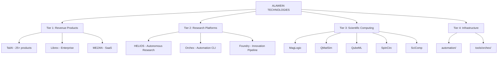

# Alawein Technologies - Master Plan

> **Single Source of Truth (SSOT)**  
> **Last Updated:** December 5, 2025  
> **Status:** 🚀 SHIP MODE  
> **Philosophy:** Ship first. Refactor later. Revenue > Architecture.

---

## Quick Navigation

| Section                                                    | Description                 |
| ---------------------------------------------------------- | --------------------------- |
| [1. Transformation Summary](#1-transformation-summary)     | What changed and why        |
| [2. Architecture Overview](#2-architecture-overview)       | Visual system diagrams      |
| [3. Project Inventory](#3-project-inventory)               | Complete product catalog    |
| [4. Business Formation](#4-business-formation)             | LLC, EIN, domains checklist |
| [5. Branding & IP](#5-branding--ip)                        | Trademarks, naming, domains |
| [6. Technical Implementation](#6-technical-implementation) | Tech stack and CLI tools    |
| [7. Priority Stack](#7-priority-stack)                     | What to do next             |
| [8. Checklists](#8-checklists)                             | Comprehensive task lists    |

---

## 1. Transformation Summary

### Naming Changes (December 5, 2025)

| Old Name       | New Name    | Reason                               | Status      |
| -------------- | ----------- | ------------------------------------ | ----------- |
| **Optilibria** | **Librex**  | Cleaner branding, balance metaphor   | ✅ Complete |
| **Atlas**      | **Orchex**  | Trademark safety (Atlas is overused) | ✅ Complete |
| **CrazyIdeas** | **Foundry** | Professional, innovation-focused     | ✅ Complete |
| `alawein`   | `alawein`   | Cleaner GitHub username              | ✅ Complete |

### Structure Changes

| Before                      | After       | Notes                        |
| --------------------------- | ----------- | ---------------------------- |
| 4 GitHub orgs               | 2 planned   | Consolidating for simplicity |
| Fragmented planning docs    | Single SSOT | This document                |
| Governance overhead         | Archived    | Moved to `.archive/`         |
| 1314 "atlas" references     | 0           | All renamed to "orchex"      |
| 126 "alawein" references | 0           | All renamed to "alawein"     |

---

## 2. Architecture Overview

### Legal Entity Structure

```
┌─────────────────────────────────────────────────────────────────────────────┐
│                           FOUNDER                                           │
│                      Meshal Alawein, PhD                                    │
│                   UC Berkeley Physics                                       │
│                              │                                              │
│              ┌───────────────┴───────────────┐                              │
│              │                               │                              │
│              ▼                               ▼                              │
│  ┌─────────────────────────┐    ┌─────────────────────────┐                │
│  │ ALAWEIN TECHNOLOGIES    │    │      REPZ LLC           │                │
│  │ LLC (California)        │    │    (Delaware)           │                │
│  │ ───────────────────     │    │ ────────────────        │                │
│  │ Core IP & Enterprise    │    │ Consumer Fitness        │                │
│  │ Form: NOW               │    │ Form: At 10K users      │                │
│  └─────────────────────────┘    └─────────────────────────┘                │
│                                                                             │
│  BRANDS UNDER ALAWEIN TECHNOLOGIES:                                         │
│  ┌──────────┬──────────┬──────────┬──────────┬──────────┐                  │
│  │Librex│  TalAI   │  HELIOS  │  Orchex  │ Foundry  │                  │
│  │  ™       │    ™     │    ™     │    ™     │    ™     │                  │
│  └──────────┴──────────┴──────────┴──────────┴──────────┘                  │
└─────────────────────────────────────────────────────────────────────────────┘
```

### GitHub Repository Structure

```
GitHub/
├── .archive/                   # Historical files (47,805+ files preserved)
│   └── organizations/          # ⚠️ ARCHIVED - All project code preserved here
│       ├── AlaweinOS/          # Librex, MEZAN, TalAI, HELIOS, SimCore, Foundry
│       ├── alawein-science/    # MagLogic, QMatSim, QubeML, SpinCirc, SciComp
│       ├── alawein-business/   # Repz
│       └── MeatheadPhysicist/  # Quantum research
│
├── .personal/                  # Personal projects (portfolio, drmalawein, rounaq)
│
├── automation/                 # AI orchestration system
│   ├── prompts/                # 49 prompts
│   ├── agents/                 # 24 agents
│   ├── workflows/              # 11 workflows
│   └── orchestration/          # Anthropic patterns
│
├── tools/
│   └── orchex/                 # Automation CLI (fka Atlas)
│
├── projects/                   # Project registry (85+ projects documented)
├── business/                   # LLC & business planning docs
├── docs/                       # Documentation
│   └── pages/                  # GitHub Pages (LLC landing pages)
└── MASTER_PLAN.md              # THIS FILE (SSOT)
```

> **Note:** The `organizations/` folder has been archived to `.archive/organizations/` as of December 5, 2025. All 47,805+ files are preserved and accessible.

---

## 3. Project Inventory

### Revenue Tier Classification



### Product Revenue Matrix

| Product                     | Type       | Price         | Status      | Priority |
| --------------------------- | ---------- | ------------- | ----------- | -------- |
| **TalAI AdversarialReview** | SaaS       | $79/mo        | MVP Ready   | 🔥 P0    |
| **TalAI GrantWriter**       | SaaS       | $199/mo       | Ready       | P1       |
| **Librex Enterprise**       | License    | $10K+/year    | Beta        | P2       |
| **MEZAN**                   | SaaS       | $10-100K/year | Production  | P2       |
| **HELIOS**                  | Enterprise | $100K+/year   | Alpha       | P3       |
| **Repz**                    | Consumer   | $9.99/mo      | Development | P4       |
| **MarketingAutomation**     | Internal   | N/A           | Planned     | P5       |

### TalAI Product Suite (25+ Products)

| Category            | Products                                                                                                                                                   | Price Range |
| ------------------- | ---------------------------------------------------------------------------------------------------------------------------------------------------------- | ----------- |
| **Core Platforms**  | IdeaForge, BuildForge, Turingo                                                                                                                             | Enterprise  |
| **Research Tools**  | AdversarialReview, AbstractWriter, CitationPredictor, DataCleaner, GrantWriter, HypothesisMatch, LitReviewBot, PaperMiner, PromptForgeLite, ResearchPricer | $29-199/mo  |
| **Advanced Tools**  | ChaosEngine, ExperimentDesigner, FailureDB, GhostResearcher, IdeaCalculus, PromptMarketplace                                                               | $39-149/mo  |
| **Domain-Specific** | MaterialsScience, Neuroscience, SyntheticBiology, CausalInference, Multimodal                                                                              | Custom      |

---

## 4. Business Formation

### Phase 1: Immediate Actions (This Week)

| Step | Task                                   | Cost     | Link                                                                                                                                | Status  |
| ---- | -------------------------------------- | -------- | ----------------------------------------------------------------------------------------------------------------------------------- | ------- |
| 1    | **File Alawein Technologies LLC (CA)** | $70      | [bizfileonline.sos.ca.gov](https://bizfileonline.sos.ca.gov/)                                                                       | ⬜ TODO |
| 2    | **Get EIN**                            | FREE     | [irs.gov/ein](https://www.irs.gov/businesses/small-businesses-self-employed/apply-for-an-employer-identification-number-ein-online) | ⬜ TODO |
| 3    | **Open Business Bank Account**         | $0-25/mo | Mercury or Relay                                                                                                                    | ⬜ TODO |
| 4    | **File Statement of Information**      | $20      | bizfile (within 90 days)                                                                                                            | ⬜ TODO |

### Phase 2: Branding (This Week)

| Step | Task                           | Cost      | Status  |
| ---- | ------------------------------ | --------- | ------- |
| 5    | Register alawein.tech          | ~$12/year | ⬜ TODO |
| 6    | Register talai.dev             | ~$15/year | ⬜ TODO |
| 7    | Register orchex.dev            | ~$15/year | ⬜ TODO |
| 8    | Add ™ to product names in docs | FREE      | ⬜ TODO |

### Phase 3: Operations (Month 1-3)

| Step | Task                           | Cost       | Status                          |
| ---- | ------------------------------ | ---------- | ------------------------------- |
| 9    | Google Workspace               | $6/user/mo | ⬜ TODO                         |
| 10   | California Franchise Tax       | $800/year  | ⬜ TODO (due 15th of 4th month) |
| 11   | Business License (if required) | Varies     | ⬜ TODO                         |

### Phase 4: Future (When Revenue Flows)

| Step | Task                     | Cost          | Trigger             |
| ---- | ------------------------ | ------------- | ------------------- |
| 12   | Trademark Registration   | $250-350/mark | When profitable     |
| 13   | Form Repz LLC (Delaware) | $90 + agent   | At 10K users        |
| 14   | Business Insurance       | Varies        | When taking clients |

---

## 5. Branding & IP

### Brand Name Status

| Name        | Status      | Industry Conflict           | Action                 |
| ----------- | ----------- | --------------------------- | ---------------------- |
| **TalAI**   | ✅ SAFE     | No conflicts found          | Proceed                |
| **Librex**  | ⚠️ CONFLICT | CBD/wellness company exists | Consider alternative   |
| **Orchex**  | ✅ SAFE     | No conflicts found          | Proceed                |
| **Foundry** | ⚠️ COMMON   | Many companies use it       | OK for internal use    |
| **MEZAN**   | ✅ SAFE     | No conflicts found          | Proceed                |
| **HELIOS**  | ⚠️ COMMON   | Multiple uses               | OK with differentiator |

### Librex Alternative Names

Since "Librex" conflicts with a CBD wellness company, consider these alternatives:

| Alternative     | Meaning                      | Domain Check    | Recommendation     |
| --------------- | ---------------------------- | --------------- | ------------------ |
| **OptiBalance** | Optimization + Balance       | optibalance.dev | ✅ Recommended     |
| **EquiLogic**   | Equilibrium + Logic          | equilogic.dev   | ✅ Good            |
| **Librex**      | From Latin "libra" (balance) | librex.dev      | ✅ Unique          |
| **Optimia**     | Optimization suffix          | optimia.dev     | ✅ Clean           |
| **Balancia**    | Balance + ia                 | balancia.dev    | ⚠️ Sounds feminine |

### Trademark Strategy

**Current Phase (Pre-Revenue):**

- Use ™ symbol freely (provides common-law rights)
- No USPTO registration needed yet

**When to File USPTO Trademark:**

- When you have paying customers
- When $250-350 per mark is affordable
- Priority marks: TalAI, MEZAN, Librex (or alternative)

### Naming Conventions

| Style          | Products   | Example                           |
| -------------- | ---------- | --------------------------------- |
| **ALL CAPS**   | Platforms  | MEZAN, HELIOS                     |
| **Title Case** | Frameworks | Librex, Orchex, Foundry           |
| **CamelCase**  | Tools      | TalAI, MagLogic, SpinCirc, QubeML |

---

## 6. Technical Implementation

### Tech Stack

| Category           | Technologies                    |
| ------------------ | ------------------------------- |
| **Languages**      | Python (core), TypeScript (web) |
| **Frameworks**     | FastAPI, Next.js, React         |
| **Infrastructure** | Docker, Kubernetes, Terraform   |
| **AI/ML**          | PyTorch, JAX, LangChain         |
| **Databases**      | PostgreSQL, Supabase            |
| **Automation**     | Orchex CLI, automation/ system  |

### Orchex CLI (Automation)

```bash
# Python CLI (automation/)
orchex prompts list
orchex agents list
orchex workflows list
orchex route "task description"

# TypeScript CLI (tools/orchex/)
npx orchex deploy list
npx orchex validate
```

### Environment Variables (Post-Rename)

```bash
# Old (deprecated)        # New (current)
ATLAS_API_PORT           → ORCHEX_API_PORT
ATLAS_API_HOST           → ORCHEX_API_HOST
ATLAS_API_KEY            → ORCHEX_API_KEY
ATLAS_JWT_SECRET         → ORCHEX_JWT_SECRET
ATLAS_OUTPUT_STYLE       → ORCHEX_OUTPUT_STYLE
```

### Test Status

| Suite             | Tests   | Status         |
| ----------------- | ------- | -------------- |
| **automation/**   | 270     | ✅ All passing |
| **tools/orchex/** | Various | ✅ All passing |

---

## 7. Priority Stack

### 🔥 P0: Ship This Week

| Task             | Details                         | Metric            |
| ---------------- | ------------------------------- | ----------------- |
| **TalAI MVP**    | Deploy AdversarialReview        | First paying user |
| **Landing Page** | talai.dev or alawein.tech/talai | Live URL          |

### P1: Legal This Week

| Task             | Details                       | Metric              |
| ---------------- | ----------------------------- | ------------------- |
| **File LLC**     | California Secretary of State | Confirmation number |
| **Get EIN**      | IRS.gov (free, instant)       | EIN number          |
| **Bank Account** | Mercury or Relay              | Account number      |

### P2: Domains This Week

| Domain       | Priority  | Cost |
| ------------ | --------- | ---- |
| alawein.tech | 🔴 High   | ~$12 |
| talai.dev    | 🔴 High   | ~$15 |
| orchex.dev   | 🟡 Medium | ~$15 |
| repz.app     | 🟢 Later  | ~$20 |

### P3: Next Week

| Task                          | Details                       |
| ----------------------------- | ----------------------------- |
| Create AlaweinLabs GitHub org | Transfer repos from AlaweinOS |
| Archive old orgs              | Keeps redirects               |
| Set up Google Workspace       | Professional email            |

### ❌ Deferred (Don't Touch Now)

- Rename SimCore → Simuverse (wait for launch)
- File trademarks (wait for revenue)
- Form Repz LLC (wait for 10K users)
- Rename Librex (evaluate alternatives first)

---

## 8. Checklists

### Business Formation Checklist

- [ ] 1. File Alawein Technologies LLC (California) - $70
- [ ] 2. Get EIN from IRS - FREE
- [ ] 3. Open business bank account
- [ ] 4. File Statement of Information - $20
- [ ] 5. Set up Google Workspace - $6/mo
- [ ] 6. Register domains (alawein.tech, talai.dev, orchex.dev)
- [ ] 7. Set up Stripe for payments
- [ ] 8. Create LLC Operating Agreement

### TalAI Launch Checklist

- [ ] 1. Deploy AdversarialReview MVP
- [ ] 2. Create landing page (talai.dev)
- [ ] 3. Set up payment processing (Stripe)
- [ ] 4. Create demo video
- [ ] 5. Write 3 blog posts
- [ ] 6. Outreach to 100 researchers

### Branding Checklist

- [ ] 1. Add ™ to all product names in documentation
- [ ] 2. Register priority domains
- [ ] 3. Create brand guidelines document
- [ ] 4. Design logos (when budget allows)
- [ ] 5. Decide on Librex alternative name
- [ ] 6. Update all README files with ™ symbols

### Codebase Cleanup Checklist

- [x] 1. Rename Optilibria → Librex
- [x] 2. Rename Atlas → Orchex (200+ files)
- [x] 3. Rename CrazyIdeas → Foundry (40+ files)
- [x] 4. Update alawein → alawein (126 files)
- [x] 5. Create default workflow config
- [x] 6. All 270 tests passing
- [ ] 7. Archive governance docs
- [ ] 8. Clean up duplicate projects

### Per-Project Checklists

#### Orchex (Automation CLI)

- [x] Rename from Atlas
- [x] Update environment variables
- [x] Update imports and references
- [ ] Document CLI commands
- [ ] Create user guide

#### Foundry (Innovation Pipeline)

- [x] Rename from CrazyIdeas
- [ ] Organize pitch decks
- [ ] Prioritize products for launch
- [ ] Create product roadmap

#### Librex (Optimization Framework)

- [x] Rename from Optilibria
- [ ] Decide on alternative name (trademark conflict)
- [ ] Document 31+ algorithms
- [ ] Create enterprise pricing

#### TalAI (AI Research Tools)

- [ ] Launch AdversarialReview
- [ ] Set up billing
- [ ] Create documentation
- [ ] Record demo videos
- [ ] Marketing outreach

#### Repz (AI Fitness)

- [ ] Continue development
- [ ] Plan separate LLC (at 10K users)
- [ ] User testing
- [ ] App store preparation

---

## Appendix A: Mindset Reminders

> "The folder structure doesn't generate revenue." — Claude Opus

> "Stop restructuring. Ship TalAI this week." — Multi-Agent Consensus

> "You are a Builder, not a Bureaucrat." — Gemini 3 Pro

> "With AI, restructuring takes seconds. Do it and move on." — Reality Check

---

## Appendix B: Contact Information

| Item               | Value                                  |
| ------------------ | -------------------------------------- |
| **Email**          | meshal@berkeley.edu                    |
| **GitHub**         | [@alawein](https://github.com/alawein) |
| **Future Email**   | contact@alawein.tech                   |
| **Future Support** | support@talai.dev                      |

---

## Appendix C: Document History

| Date        | Change                                  |
| ----------- | --------------------------------------- |
| Dec 5, 2025 | Created SSOT (this document)            |
| Dec 5, 2025 | Consolidated from 12 planning documents |
| Dec 5, 2025 | Updated username alawein → alawein   |
| Dec 5, 2025 | Completed Atlas → Orchex rename         |
| Dec 5, 2025 | Completed CrazyIdeas → Foundry rename   |
| Dec 5, 2025 | Added MarketingAutomation to registry   |
| Dec 5, 2025 | Created ACTION_PLAN.md                  |

---

## Appendix D: Legacy Documents

These documents in `business/` are superseded by this SSOT:

| Document                    | Status                  |
| --------------------------- | ----------------------- |
| MASTER_PLAN_CONSOLIDATED.md | Superseded              |
| COMPLETE_PORTFOLIO_PLAN.md  | Superseded              |
| FINAL_LLC_STRUCTURE_PLAN.md | Superseded              |
| MULTI_AGENT_ANALYSIS.md     | Superseded (historical) |
| MULTI_LLM_ANALYSIS.md       | Superseded (historical) |
| BUSINESS_ANALYSIS_REPORT.md | Superseded (historical) |

**Recommendation:** Move to `.archive/business-planning/` after review.

---

_This is the Single Source of Truth (SSOT) for Alawein Technologies._
_Last updated: December 5, 2025_
