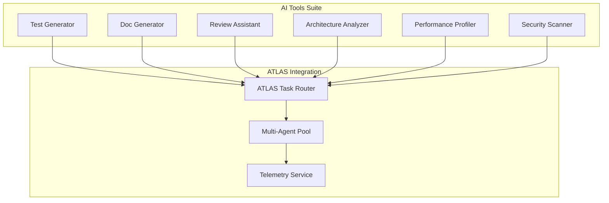

oj# AI Development Tools Suite

**AI-Powered Development Tools that Leverage ATLAS Architecture**

A comprehensive suite of specialized AI-powered development tools designed to complement the ATLAS multiagent orchestration platform. These tools address specific development workflow challenges including automated testing, documentation generation, code review automation, architecture analysis, performance profiling, and security scanning.

## 🏗️ Architecture Overview



## 🛠️ Available Tools

### 1. Test Generator (`test-generator/`)
AI-powered test suite creation with intelligent coverage analysis and optimization.

**Features:**
- Automated test case generation
- Coverage gap analysis
- Edge case identification
- Multi-framework support (Jest, pytest, JUnit, etc.)

### 2. Documentation Generator (`doc-generator/`)
Automated API documentation with interactive examples and API explorers.

**Features:**
- API documentation generation
- Interactive code examples
- Multi-format output (Markdown, HTML, PDF)
- Integration with existing docs

### 3. Code Review Assistant (`review-assistant/`)
Intelligent code review with contextual suggestions and automated feedback.

**Features:**
- Automated code analysis
- Best practice recommendations
- Security vulnerability detection
- Performance optimization suggestions

### 4. Architecture Analyzer (`architecture-analyzer/`)
System design analysis and dependency mapping with visualization.

**Features:**
- Dependency graph generation
- Architecture pattern recognition
- Coupling/cohesion analysis
- Refactoring recommendations

### 5. Performance Profiler (`performance-profiler/`)
AI-driven performance analysis and bottleneck detection with optimization recommendations.

**Features:**
- Runtime performance analysis
- Memory leak detection
- Bottleneck identification
- Optimization suggestions

### 6. Security Scanner (`security-scanner/`)
Intelligent vulnerability detection and remediation suggestions.

**Features:**
- Static analysis for vulnerabilities
- Dependency security scanning
- Pattern-based threat detection
- Remediation recommendations

## 🚀 Quick Start

```bash
# Install dependencies
npm install

# Run all tools via unified CLI
npx ai-tools --help

# Generate tests for a codebase
npx ai-tools test generate --path ./src --framework jest

# Analyze architecture
npx ai-tools arch analyze --path ./src --output architecture.json

# Run security scan
npx ai-tools security scan --path ./src --report security-report.md
```

## 🔧 Integration with ATLAS

All tools integrate seamlessly with ATLAS services:

```typescript
import { AITools, ATLAS } from 'ai-tools-suite';

// Initialize with ATLAS
const atlas = new ATLAS();
const aiTools = new AITools({ atlas });

// Tools automatically use ATLAS for task routing
await aiTools.test.generate({
  path: './src',
  framework: 'jest'
});
```

## 📊 Multi-Agent Support

Leverages ATLAS's multi-agent orchestration:

- **Claude Sonnet**: Complex reasoning and code generation
- **GPT-4 Turbo**: Documentation and analysis tasks
- **Gemini Pro**: Performance analysis and optimization
- **Specialized Models**: Domain-specific capabilities

## 🔄 Workflow Integration

Seamless integration with development pipelines:

```yaml
# .github/workflows/ci.yml
- name: AI Code Review
  run: npx ai-tools review analyze --pr ${{ github.event.number }}

- name: Security Scan
  run: npx ai-tools security scan --path ./src

- name: Performance Analysis
  run: npx ai-tools perf profile --path ./src
```

## 📈 Advanced Features

### Machine Learning
- Predictive test case generation
- Vulnerability pattern recognition
- Performance bottleneck prediction

### Natural Language Processing
- Intelligent documentation generation
- Code review comment analysis
- Architecture description parsing

### Graph Analysis
- Dependency relationship mapping
- Architecture pattern detection
- Performance flow analysis

## 🏢 Enterprise Features

- **Audit Trails**: Complete logging of all AI interactions
- **Compliance**: SOC 2, GDPR, and security standard compliance
- **Scalability**: Horizontal scaling with ATLAS orchestration
- **Monitoring**: Real-time metrics and alerting

## 📚 API Reference

### Unified CLI Interface

```bash
ai-tools [tool] [command] [options]
```

### REST API

```bash
POST /api/v1/tools/test/generate
POST /api/v1/tools/docs/generate
POST /api/v1/tools/review/analyze
POST /api/v1/tools/arch/analyze
POST /api/v1/tools/perf/profile
POST /api/v1/tools/security/scan
```

### TypeScript SDK

```typescript
import { TestGenerator, DocGenerator, ReviewAssistant } from 'ai-tools-suite';

const testGen = new TestGenerator();
await testGen.generateTests('./src');
```

## 🤝 Contributing

See [CONTRIBUTING.md](../CONTRIBUTING.md) for development setup and contribution guidelines.

## 📄 License

MIT License - see [LICENSE](../LICENSE) for details.</instructions>
